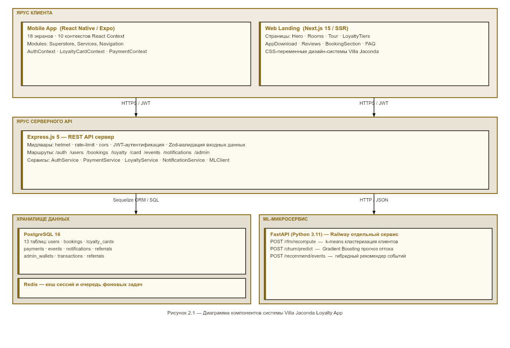
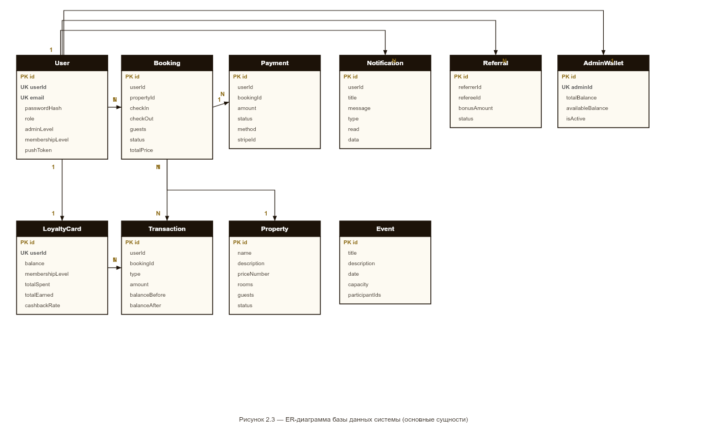
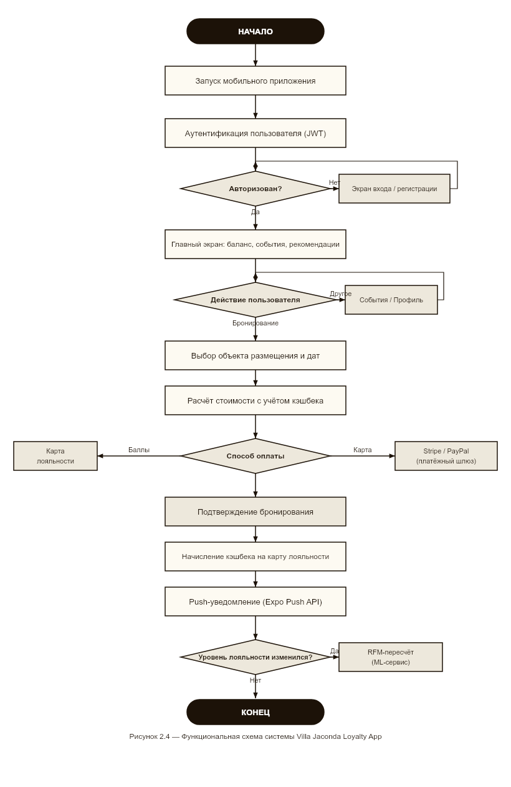

# Abstract

The topic of the thesis is an intelligent management system for a premium loyalty programme. The subject of the research is methods of automated customer segmentation and behaviour prediction in a client-server information system. The aim of the work is to design and implement a mobile and server application with an analytical module based on machine learning methods using the Villa Jaconda facility as an example.

The work applies RFM analysis, binary classification for churn prediction, a hybrid recommender approach, and methods of object-oriented and component-based design.

As a result, the Villa Jaconda Loyalty App software system was developed. It includes a mobile client built with React Native and Expo, a server-side component built with Node.js, Express and PostgreSQL, and an ML microservice built with Python, FastAPI and scikit-learn. Experimental evaluation of the models was carried out on a synthetic dataset containing 1500 users.

The practical application area of the developed system includes premium hospitality and short-term rental businesses with a limited but valuable customer base. The proposed approach reduces the amount of manual administration and supports more consistent loyalty programme management.


# Аннотация

Тема выпускной квалификационной работы — интеллектуальная система управления премиальной программой лояльности. Предмет исследования — методы автоматизированной сегментации клиентов и прогнозирования их поведения в клиент-серверной информационной системе. Цель работы — проектирование и разработка мобильного и серверного приложения с аналитическим модулем на основе методов машинного обучения на примере объекта размещения Villa Jaconda.

В работе использованы методы RFM-анализа, бинарной классификации для прогноза оттока, гибридного рекомендательного подхода, а также методы объектно-ориентированного и компонентного проектирования.

В результате разработана программная система Villa Jaconda Loyalty App, включающая мобильный клиент на React Native и Expo, серверную часть на Node.js, Express и PostgreSQL, а также ML-микросервис на Python, FastAPI и scikit-learn. Экспериментальная оценка моделей выполнена на синтетическом наборе данных, содержащем 1500 пользователей.

Практическая область применения разработанной системы — предприятия премиального гостиничного бизнеса и краткосрочной аренды, работающие с ограниченной, но ценной клиентской базой. Предложенный подход позволяет сократить объём ручного администрирования и сделать управление программой лояльности более последовательным.


# ВВЕДЕНИЕ

Настоящая выпускная квалификационная работа выполнена на основе проекта **Villa Jaconda Loyalty App** — клиент-серверной системы для управления программой лояльности и бронированиями в небольшом гостиничном комплексе премиального сегмента. До начала разработки взаимодействие с постоянными гостями осуществлялось преимущественно вручную: бронирование оформлялось по телефону и в мессенджерах, расчёт скидок зависел от администратора, сведения о клиентах и истории их посещений хранились в нескольких несвязанных источниках.

Подобная организация работы создаёт сразу несколько проблем. Во-первых, отсутствует единая цифровая среда, в которой можно проследить историю взаимодействия с клиентом и объективно оценить его лояльность. Во-вторых, ручной порядок расчётов и согласований увеличивает время обслуживания и затрудняет масштабирование сервиса. В-третьих, традиционная схема программы лояльности, основанная только на накопленной сумме покупок, плохо отражает реальное поведение клиента: пользователь, который активно пользовался услугами в прошлом, но давно не возвращался, формально может сохранять высокий статус наравне с действительно активными гостями.

Практика показала, что для рассматриваемого объекта недостаточно только заменить физическую карту цифровой. Требовалась система, которая объединяет мобильный клиент, серверную часть, хранение данных о бронированиях и платежах, а также средства аналитики, позволяющие пересчитывать уровень лояльности не по одному показателю, а по совокупности характеристик поведения клиента. Поэтому в состав разрабатываемого решения включён интеллектуальный модуль, использующий RFM-анализ, прогнозирование оттока и рекомендательные механизмы.

**Актуальность работы.** Ниша управления лояльностью для малых премиальных объектов размещения практически не охвачена готовыми решениями с ML-составляющей. Существующие платформы либо не поддерживают кастомизацию, либо не имеют мобильного клиента, либо не содержат интеллектуальных алгоритмов — подробный сравнительный анализ приведён в §1.4. Доступность библиотек машинного обучения (scikit-learn, FastAPI) и кросс-платформенных инструментов разработки (React Native, Expo) сделала решение этой задачи практически реализуемым в рамках одного проекта.

**Объектом исследования** являются процессы управления премиальной программой лояльности в индустрии гостеприимства и аренды премиум-недвижимости.

**Предметом исследования** выступают методы автоматизированной сегментации клиентов, прогнозирования поведения и формирования персонализированных предложений в составе клиент-серверной информационной системы.

**Целью выпускной квалификационной работы** является проектирование и разработка интеллектуальной системы управления премиальной программой лояльности, объединяющей мобильное приложение, серверный программный комплекс и аналитический модуль на основе алгоритмов машинного обучения.

Для достижения поставленной цели сформулированы следующие задачи:

1. Провести анализ предметной области, существующих программ лояльности в индустрии гостеприимства, обзор аналогичных программных решений и алгоритмических подходов; сформулировать функциональные и нефункциональные требования к разрабатываемой системе.
2. Спроектировать архитектуру клиент-серверного программного комплекса, включающего мобильный клиент, REST-сервер и интеллектуальный аналитический модуль; разработать инфологическую и логическую модели базы данных.
3. Разработать алгоритмы интеллектуального модуля: RFM-сегментацию клиентов с динамическим присвоением уровней лояльности, бинарный классификатор оттока и гибридную рекомендательную модель.
4. Реализовать программный комплекс на платформах React Native, Node.js/Express/PostgreSQL и Python/scikit-learn с взаимодействием компонентов через REST API.
5. Реализовать средства защиты информации в соответствии с требованиями к корпоративным информационным системам.
6. Провести тестирование программного комплекса и экспериментальную оценку качества моделей машинного обучения.
7. Подготовить эксплуатационную документацию и оценить экономическую эффективность внедрения.

**Методы исследования:** системный анализ предметной области и существующих программных решений, методы объектно-ориентированного и компонентного проектирования, методы машинного обучения (кластеризация k-means, градиентный бустинг, коллаборативная фильтрация), методы инфологического и логического проектирования реляционных баз данных, методы экспериментальной проверки программных решений и автоматизированное тестирование.

**Планируемые результаты работы:**

- спроектированная трёхуровневая архитектура системы с детально проработанной ER-диаграммой и описанием API-контрактов;
- мобильное приложение Villa Jaconda Loyalty App для iOS и Android с реализованной функциональностью бронирования, цифровой карты лояльности, платежей и push-уведомлений;
- серверный программный комплекс Node.js/Express + PostgreSQL с миграциями;
- интеллектуальный модуль с тремя моделями (RFM-сегментация, прогноз оттока, рекомендательная система), интегрированный с серверной частью;
- экспериментальные оценки качества моделей машинного обучения на наборе данных системы;
- оценка себестоимости разработки и внедрения.

**Практическая значимость** состоит в том, что разработанный комплекс может использоваться как основа для цифровизации программы лояльности в небольших объектах размещения премиального сегмента. Интеллектуальный модуль автоматизирует сегментацию клиентов и формирование персонализированных предложений, а клиент-серверная архитектура позволяет развивать решение по мере появления новых бизнес-требований.

**Структура пояснительной записки.** Работа состоит из введения, трёх глав, заключения, перечня условных обозначений, списка источников и приложений. В первой главе выполнен анализ предметной области, обзор существующих решений и сформулирована постановка задачи. Во второй главе описано проектирование архитектуры, базы данных и алгоритмов интеллектуального модуля. В третьей главе изложены детали реализации, методы защиты, результаты тестирования и экономическая оценка.


# 1 ИССЛЕДОВАНИЕ И АНАЛИЗ ПРЕДМЕТНОЙ ОБЛАСТИ

## 1.1 Описание поставленной задачи

Предметной областью настоящего исследования является управление программами лояльности в индустрии гостеприимства и краткосрочной аренды премиум-недвижимости. Под программой лояльности понимается совокупность бизнес-процессов и информационных средств, направленных на формирование долгосрочных отношений между организацией и её клиентами через систему накопительных привилегий, персонализированных предложений и автоматизированной коммуникации.

Заказчиком исследования выступает Villa Jaconda — частный комплекс премиальной аренды, включающий несколько объектов категории «люкс». Деятельность заказчика характеризуется ограниченным контингентом постоянных клиентов (от нескольких десятков до нескольких сотен активных гостей), высоким средним чеком, выраженной сезонностью спроса и существенной долей повторных бронирований. Указанные особенности отличают рассматриваемый сегмент рынка от массового туризма и определяют специфические требования к организации программы лояльности.

В рамках действующей до начала работ системы взаимодействие с клиентом организовано традиционным образом: бронирование осуществляется по телефонному или мессенджер-каналу, расчёт стоимости производится администратором вручную, скидки и привилегии регулируются индивидуально в пределах полномочий администратора, физическая карта лояльности отсутствует. Информация о клиентах, их истории посещений и финансовых операциях хранится разрозненно — частично в табличных документах, частично в переписке. Подобная организация порождает ряд недостатков, среди которых наиболее существенными являются:

— отсутствие единого источника достоверных данных о клиенте и его жизненном цикле;
— невозможность объективной оценки ценности клиента и обоснованного распределения привилегий;
— значительные временные затраты администратора на расчёты и согласования;
— отсутствие средств автоматизированной коммуникации с клиентом (рассылка персональных предложений, напоминаний, уведомлений);
— невозможность анализа эффективности программы лояльности и принятия управленческих решений на основе количественных показателей.

Поставленная заказчиком задача формулируется следующим образом: разработать программный комплекс, обеспечивающий комплексное цифровое управление премиальной программой лояльности и объединяющий следующие функциональные направления:

— ведение единой базы клиентов с возможностью учёта всех ключевых параметров их взаимодействия с заказчиком;
— автоматизированный расчёт уровня лояльности клиента и предоставляемых ему привилегий;
— цифровая карта лояльности, заменяющая физический носитель и доступная клиенту через мобильное приложение;
— автоматизация процесса бронирования с прозрачным расчётом стоимости и учётом действующих привилегий;
— ведение истории платёжных операций с поддержкой различных способов оплаты;
— система персонализированных уведомлений и предложений;
— инструменты бизнес-аналитики, позволяющие администратору комплекса оценивать эффективность программы лояльности;
— административная подсистема для управления пользователями, объектами и событиями.

Дополнительным требованием, отличающим разрабатываемую систему от типовых решений рассматриваемого класса, выступает наличие интеллектуального модуля. Под интеллектуальным модулем понимается подсистема, реализующая алгоритмы машинного обучения для решения трёх задач: автоматической сегментации клиентов с динамическим присвоением уровня лояльности, прогнозирования вероятности оттока клиента и формирования персональных рекомендаций по событиям и дополнительным услугам. Включение интеллектуального модуля обусловлено тем, что в премиальном сегменте, где число клиентов невелико, а ценность каждого индивидуального клиента высока, переход от усреднённых маркетинговых правил к моделям, учитывающим индивидуальный поведенческий профиль, способен существенно повысить эффективность программы лояльности.

## 1.2 Обоснование актуальности исследуемой задачи

Премиальная аренда недвижимости относится к сегментам, в которых клиентская база сравнительно невелика, однако средняя ценность каждого постоянного гостя высока. По данным отраслевых исследований, стоимость привлечения нового клиента (Customer Acquisition Cost, CAC) в премиальном сегменте существенно превышает стоимость удержания существующего. Это означает, что заметная часть экономического эффекта формируется именно за счёт возвратных клиентов. Следовательно, программа лояльности в данном случае выступает не вспомогательным маркетинговым инструментом, а важным элементом операционной деятельности.

На практике малые премиальные объекты нередко ведут этот процесс вручную: сведения о постоянных гостях и их привилегиях зависят от субъективной памяти администратора, скидки назначаются индивидуально, данные о клиентах хранятся разрозненно. В таких условиях закономерно возникает задача цифровизации, однако её решение требует учёта отраслевой специфики.

Простая замена «физической карты» на «карту в приложении» проблему не решает, если алгоритм присвоения уровня остаётся пороговым: «потратил 50 000 рублей — получил Gold». Такое правило не учитывает ни давность последней покупки, ни регулярность визитов. Клиент, бывший постоянным три года назад, но не появлявшийся последний год, занимает место в сегменте наравне с действительно активным гостем. Это приводит к неправильному распределению привилегий и маркетингового бюджета.

Именно здесь появляется потребность в интеллектуальном управлении. Методы RFM-анализа и машинного обучения позволяют оценивать клиента по трём измерениям сразу — давности, частоте и сумме покупок — и автоматически пересчитывать сегментацию при изменении поведения. Добавление модели прогноза оттока даёт возможность выявлять «угасающих» клиентов до того, как они фактически перестанут обращаться, и заблаговременно отправлять удерживающее предложение.

До недавнего времени подобные задачи решались силами отдельных аналитических команд на специализированных платформах — это было доступно только крупным сетям. Сегодня открытые библиотеки scikit-learn, XGBoost, pandas и фреймворки React Native, FastAPI позволяют реализовать весь этот функционал в рамках одного проекта небольшой командой разработчиков.

Наконец, рынок программных решений в данном сегменте развит ограниченно: крупные платформы лояльности (Marriott Bonvoy, Hilton Honors) закрыты для внешних организаций, универсальные SaaS-решения не специализированы под гостиничный бизнес, а open-source варианты, как правило, не имеют готового мобильного клиента и интеллектуальных модулей. Это делает разработку специализированного решения обоснованной как с практической, так и с исследовательской точки зрения.

## 1.3 Современное состояние исследуемой задачи

Современные программы лояльности в индустрии гостеприимства прошли значительный путь развития от простейших схем накопления штампов и физических карт до сложных цифровых экосистем, объединяющих мобильное приложение, серверную часть, аналитический модуль и интеграции с платёжными системами. В развитии данного класса систем можно выделить несколько технологических поколений.

Первое поколение (до 2000-х годов) — статические программы лояльности на основе физических карт. Клиент получает пластиковую карту с уникальным идентификатором, на которой накапливаются баллы за совершённые покупки или услуги. Учёт ведётся в локальной информационной системе организации, без какой-либо обратной связи с клиентом. Основные ограничения данного подхода — необходимость наличия физической карты у клиента, отсутствие персонализированной коммуникации и невозможность сбора аналитических данных за пределами факта совершения операции.

Второе поколение (2000-е — начало 2010-х годов) — программы лояльности на основе веб-кабинетов с электронной картой. Карта лояльности существует в виде записи в базе данных и идентифицируется по штрих-коду или номеру в личном кабинете на сайте организации. Клиент получает доступ к балансу баллов, истории операций и каталогу привилегий через веб-интерфейс. Подобный подход устранил необходимость физического носителя, однако сохранил значительную часть ограничений: коммуникация осуществлялась преимущественно через электронную почту, мобильный канал был развит слабо, аналитика ограничивалась стандартными отчётами.

Третье поколение (2010-е годы) — мобильно-ориентированные программы лояльности. Карта лояльности интегрируется в мобильное приложение и идентифицируется QR-кодом или NFC-меткой. Появляется возможность push-уведомлений, геолокационной коммуникации, интеграции с мобильными платёжными системами (Apple Pay, Google Pay). Программы лояльности крупных гостиничных сетей (Marriott Bonvoy, Hilton Honors, IHG One Rewards) активно развивают мобильные приложения, превращая их в основной канал взаимодействия с клиентом. Однако алгоритмическое ядро программ лояльности данного поколения, как правило, остаётся консервативным: уровни клиента определяются простыми пороговыми правилами, основанными на накопленной за период сумме операций.

Четвёртое поколение (с конца 2010-х годов по настоящее время) — программы лояльности с элементами интеллектуального управления. Характеризуются переходом от статических правил к моделям, использующим методы машинного обучения для сегментации клиентов, прогнозирования их поведения и формирования персонализированных предложений. Программы данного поколения являются предметом активных академических и прикладных исследований. Их полноценные коммерческие реализации в индустрии гостеприимства пока относительно немногочисленны: указанные методы значительно более распространены в e-commerce (Amazon, AliExpress) и развлекательных платформах (Netflix, Spotify), однако их адаптация к специфике гостиничного бизнеса и особенно к премиум-сегменту представляет собой самостоятельную исследовательскую задачу.

Анализ научно-технической литературы показывает, что основными алгоритмическими подходами, применяемыми в современных программах лояльности, являются:

— модели сегментации на основе RFM-анализа (Recency, Frequency, Monetary), позволяющие классифицировать клиентскую базу по трём измерениям: давность последнего взаимодействия, частота взаимодействий и совокупная финансовая ценность. Метод предложен ещё в 1990-х годах применительно к директ-маркетингу и в настоящее время рассматривается как промышленный стандарт сегментации;

— кластерный анализ с применением алгоритма k-средних и его модификаций, позволяющий выявлять группы клиентов со схожим поведенческим профилем без предварительного определения правил отнесения;

— модели прогнозирования оттока клиентов (churn prediction), основанные на бинарной классификации и реализуемые с использованием различных алгоритмов — логистической регрессии, случайного леса, градиентного бустинга. Целью моделей является выявление клиентов с высокой вероятностью отказа от дальнейшего взаимодействия для формирования удерживающих маркетинговых воздействий;

— рекомендательные системы, основанные на коллаборативной фильтрации, контент-анализе или гибридных схемах. В индустрии гостеприимства подобные модели применяются для формирования предложений по дополнительным услугам, событиям, объектам размещения;

— модели динамического ценообразования, основанные на анализе спроса, сезонности и поведения конкурентов. Данный класс моделей выходит за рамки задач программы лояльности в узком смысле, однако пересекается с ней при формировании персонализированных предложений.

Несмотря на наличие сформировавшейся методологической базы, прикладные реализации указанных подходов в готовых программных продуктах для индустрии гостеприимства остаются ограниченными. Большинство коммерческих платформ лояльности предоставляют либо средства администрирования статических правил, либо общие средства аналитики, без встроенных интеллектуальных моделей. Возможность интеграции собственных ML-моделей в большинство существующих коммерческих платформ отсутствует или существенно ограничена.

## 1.4 Обзор методов решения подобных задач

С целью обоснования архитектурных и алгоритмических решений, принятых при разработке настоящей системы, выполнен сравнительный анализ существующих программных продуктов и платформ, относимых к классу систем управления программами лояльности. Рассмотрены как программы лояльности крупных гостиничных сетей, так и SaaS-платформы, и решения с открытым исходным кодом.

### 1.4.1 Marriott Bonvoy

Marriott Bonvoy — программа лояльности Marriott International, объединяющая более 30 брендов отелей и свыше 190 миллионов участников. Предусмотрено шесть уровней членства (от Member до Ambassador Elite) с пороговым отнесением по числу ночей за год. Технически программа хорошо проработана: мобильное приложение поддерживает цифровой ключ от номера, бесконтактный заезд, управление баллами.

Для целей настоящей работы Marriott Bonvoy интереса не представляет: это закрытая экосистема исключительно для объектов сети Marriott. Сторонняя организация не может подключить эту программу или воспользоваться её инфраструктурой. Алгоритмика уровней остаётся пороговой и ML-методов не применяет.

### 1.4.2 Hilton Honors

Программа лояльности Hilton (четыре уровня: Member, Silver, Gold, Diamond) устроена аналогично Marriott Bonvoy: используются пороговые правила по числу ночей, предусмотрены сопоставимые возможности мобильного приложения и сохраняется закрытость для внешних организаций. Для целей настоящей работы её ограничения по существу совпадают с ограничениями Marriott Bonvoy.

### 1.4.3 Booking.com Genius

Genius — программа лояльности агрегатора Booking.com, действующая в рамках платформы. Включает три уровня, отнесение к которым осуществляется по числу подтверждённых бронирований за период в 24 месяца. Привилегии участников ограничены скидками на размещение, ранним заездом и бесплатными завтраками, предоставляемыми объектами размещения, добровольно присоединившимися к программе.

Достоинства — широкий охват за счёт глобальной аудитории Booking.com и простая для понимания клиента схема. Недостатки применительно к настоящей задаче состоят в том, что программа функционирует исключительно в рамках платформы Booking.com и предполагает участие объекта размещения на условиях агрегатора; возможность использования решения как самостоятельного инструмента организации отсутствует; средства глубокой настройки и интеллектуального управления не предусмотрены.

### 1.4.4 Loyverse

Loyverse — платформа POS-учёта и базовой программы лояльности, ориентированная на малый бизнес (преимущественно розничную торговлю и общественное питание). Поддерживает мобильное приложение с электронной картой лояльности, формируемой по номеру телефона клиента, и простейшие маркетинговые сценарии (накопительные скидки, e-mail-рассылки).

Достоинства — бесплатная базовая версия, лёгкость внедрения, наличие мобильного клиента и серверной части. Недостатки применительно к премиум-сегменту аренды — отсутствие специфической функциональности, связанной с бронированием объектов размещения; примитивная схема программы лояльности (единый накопительный балл без уровней или сегментации); полное отсутствие средств интеллектуальной аналитики; ограниченные возможности кастомизации интерфейса под бренд организации.

### 1.4.5 Antavo

Antavo — корпоративная SaaS-платформа управления программами лояльности, ориентированная на крупный ритейл и услуги. Предоставляет средства настройки правил программы (баллы, уровни, привилегии, кампании), интеграцию с CRM-системами, развитые средства аналитики и сегментации. Поддерживает гибкие сценарии геймификации, реферальные программы и кампании на основе событий.

Достоинства — широкие возможности настройки, развитая аналитика, поддержка нестандартных сценариев. Недостатки — высокая стоимость владения, ориентированная на крупных корпоративных заказчиков; отсутствие готового мобильного клиента (предоставляются SDK и API, но конечное приложение должна разрабатывать организация-заказчик); встроенные интеллектуальные модули реализуют преимущественно правила сегментации, а не полноценные ML-модели; платформа не специализирована для индустрии гостеприимства.

### 1.4.6 OpenLoyalty

OpenLoyalty — платформа управления программами лояльности с открытым исходным кодом, реализованная на стеке PHP / Symfony. Предоставляет headless API для управления клиентами, баллами, уровнями, кампаниями, и опциональный административный интерфейс. Подразумевает, что организация-заказчик разрабатывает собственный клиентский интерфейс (мобильное приложение, веб-кабинет) поверх API платформы.

Достоинства — открытый исходный код, гибкость настройки, отсутствие лицензионных платежей. Недостатки — значительные затраты на доработку и интеграцию (платформа предоставляет инфраструктурный уровень, но не готовый продукт); ограниченная развитость в части мобильных клиентов; отсутствие встроенных интеллектуальных модулей; необходимость самостоятельной разработки специфической функциональности, связанной с гостиничным бизнесом.

### 1.4.7 Сравнительный анализ

Сравнительный анализ рассмотренных решений по ключевым критериям, релевантным поставленной задаче, представлен в таблице 1.1. Критериями выступают: ориентированность на индустрию аренды премиум-недвижимости, наличие собственного мобильного клиента, возможность глубокой кастомизации, наличие встроенного интеллектуального модуля (ML-сегментация и/или прогноз оттока), стоимость владения и возможность использования продукта сторонней организацией.

Таблица 1.1 — Сравнительный анализ программ лояльности

| Решение | Сегмент | Мобильный клиент | Кастомизация | ML-модули | Открытость | Стоимость |
|---------|---------|------------------|--------------|-----------|------------|-----------|
| Marriott Bonvoy | Сетевые отели | Есть | Нет | Нет | Закрытая | Только Marriott |
| Hilton Honors | Сетевые отели | Есть | Нет | Нет | Закрытая | Только Hilton |
| Booking.com Genius | OTA-агрегатор | Есть | Нет | Нет | Закрытая | Комиссия Booking |
| Loyverse | Малый бизнес | Есть | Ограниченно | Нет | SaaS | Низкая (freemium) |
| Antavo | Корпоративный | Только SDK | Высокая | Частично | SaaS | Высокая |
| OpenLoyalty | Универсальная | Нет | Высокая | Нет | Open Source | Только TCO |
| Разрабатываемая система | Премиум-аренда | Есть | Полная | Есть | Своя разработка | TCO разработки |

Анализ таблицы 1.1 позволяет сделать вывод о наличии устойчивого пробела на рынке программных решений: ни одна из рассмотренных платформ не удовлетворяет одновременно требованиям ориентированности на сегмент премиальной аренды объектов размещения, наличия собственного мобильного клиента, возможности глубокой кастомизации и наличия встроенного интеллектуального модуля. Указанный пробел подтверждает обоснованность разработки специализированной системы, учитывающей специфику премиум-сегмента и реализующей интеллектуальные алгоритмы управления программой лояльности.

### 1.4.8 Анализ алгоритмических подходов

С точки зрения алгоритмической основы рассмотренные решения делятся на две группы. Первая, преобладающая, использует статические пороговые правила: уровень клиента и его привилегии определяются накопленными за фиксированный период суммами операций или числом совершённых действий. Подобный подход прост в реализации и понятен пользователю, однако обладает рядом существенных недостатков: он чувствителен к выбору пороговых значений, не учитывает индивидуальной динамики поведения клиента, не способен к обнаружению неочевидных закономерностей и не позволяет прогнозировать предстоящие изменения статуса клиента.

Вторая группа использует элементы интеллектуального управления — RFM-сегментацию, кластерный анализ, модели прогнозирования. Из рассмотренных решений к данной группе с оговорками могут быть отнесены лишь Antavo и в ограниченной степени отдельные модули Marriott Bonvoy (используемые для внутренних аналитических задач, но не для назначения уровня клиенту). Однако даже в указанных продуктах интеллектуальные модели не охватывают всю триаду задач — сегментацию, прогнозирование оттока и формирование рекомендаций — а реализуют преимущественно отдельные её элементы.

С учётом изложенного, в настоящей работе принято решение о разработке системы, реализующей все три направления интеллектуального управления программой лояльности — динамическую RFM-сегментацию, прогноз оттока и гибридную рекомендательную модель. Подробное описание алгоритмов приведено в главе 2.

## 1.5 Постановка задачи, системные требования и требования к данным

На основании проведённого анализа предметной области и существующих решений сформулирована детальная постановка задачи, включающая функциональные и нефункциональные требования к разрабатываемой системе, а также требования к входным и выходным данным.

### 1.5.1 Функциональные требования

К разрабатываемой системе предъявляются следующие функциональные требования:

ФТ-1. Регистрация пользователей выполняется исключительно администратором организации. Самостоятельная регистрация клиентов недоступна. Указанное требование обусловлено премиальным характером программы и необходимостью обеспечения контролируемого приёма участников.

ФТ-2. Аутентификация пользователей реализуется по схеме логин/пароль с применением JSON Web Token. Поддерживается обновление токена по refresh-механизму. Срок действия access-токена — не более 1 часа.

ФТ-3. Система предусматривает две роли пользователей: обычный клиент и администратор. Для роли администратора предусмотрены два уровня доступа: финансовый администратор с правами на финансовые операции и операционный администратор без доступа к финансовому модулю.

ФТ-4. Каждому клиенту присваивается цифровая карта лояльности, идентифицируемая уникальным QR-кодом. QR-код доступен в мобильном приложении и используется для идентификации клиента на стороне организации.

ФТ-5. Клиент имеет четыре уровня лояльности: Bronze, Silver, Gold, Platinum. Уровень определяется автоматически на основании RFM-сегментации, реализуемой интеллектуальным модулем.

ФТ-6. Система обеспечивает функциональность бронирования объектов размещения: выбор объекта, выбор дат, расчёт стоимости с учётом уровня лояльности, оформление бронирования.

ФТ-7. Система поддерживает множественные способы платежа: банковская карта (Visa, MasterCard), сервис PayPal, оплата с цифровой карты лояльности, банковский перевод. Расчёты с банковскими картами выполняются через интеграцию со Stripe.

ФТ-8. Система ведёт историю всех финансовых операций — пополнений цифровой карты, оплат бронирований, начислений и списаний баллов. Доступ к истории операций предоставлен клиенту в личном кабинете и администратору в финансовом модуле.

ФТ-9. Система обеспечивает рассылку push-уведомлений участникам программы. Поддерживаются уведомления о бронированиях, изменениях статуса, специальных предложениях и событиях.

ФТ-10. Интеллектуальный модуль выполняет три класса задач: автоматическое присвоение уровня лояльности на основании RFM-сегментации; прогноз вероятности оттока клиента; формирование персональных рекомендаций по событиям и дополнительным услугам.

ФТ-11. Административная подсистема обеспечивает управление клиентами (просмотр, редактирование, отключение), управление объектами размещения, управление событиями (создание, редактирование, активация/деактивация), просмотр аналитических отчётов.

ФТ-12. Финансовая административная подсистема обеспечивает управление выводами средств, просмотр финансовой статистики (общий оборот, оборот по способам платежей, оборот по объектам), формирование отчётов.

ФТ-13. Система предусматривает функциональность реферальной программы: каждый клиент имеет уникальный реферальный код, при использовании которого новый участник получает приветственный бонус, а реферер — реферальное вознаграждение.

ФТ-14. Маркетинговый веб-сайт (лендинг) обеспечивает представление информации о вилле, программе лояльности, возможностях мобильного приложения. Лендинг включает форму обратной связи и контактные данные.

### 1.5.2 Нефункциональные требования

К разрабатываемой системе предъявляются следующие нефункциональные требования:

НФТ-1. Производительность мобильного клиента. Запуск приложения — не более 3 секунд на устройствах среднего класса. Время отклика основных операций — не более 500 мс при стабильном соединении.

НФТ-2. Производительность серверной части. Среднее время обработки REST-запроса — не более 200 мс при нагрузке до 100 одновременно работающих пользователей. Время выполнения операций интеллектуального модуля (RFM-классификация, прогноз оттока) для одного клиента — не более 1 с.

НФТ-3. Поддерживаемые платформы клиентов. Мобильное приложение работает на устройствах Android (версия 10.0 и выше) и iOS (версия 14.0 и выше). Маркетинговый веб-сайт корректно отображается в современных версиях браузеров Chrome, Safari, Firefox и Edge.

НФТ-4. Информационная безопасность. Все данные передаются с использованием HTTPS. Пароли пользователей хранятся в виде солёных хешей, формируемых алгоритмом bcrypt. Реализована защита от типовых атак на веб-приложения (SQL-инъекции, XSS, CSRF) на основе общепринятых рекомендаций OWASP.

НФТ-5. Надёжность. Серверная часть обеспечивает доступность не ниже 99 % за календарный месяц. Восстановление после сбоя при перезапуске — не более 60 секунд. Все ключевые операции (платежи, изменения статусов) являются идемпотентными.

НФТ-6. Масштабируемость. Архитектура серверной части допускает горизонтальное масштабирование за счёт независимости экземпляров. Интеллектуальный модуль может быть вынесен в отдельный экземпляр и масштабирован независимо от основного API.

НФТ-7. Сопровождаемость. Исходный код разделён на логические модули и сопровождается автоматизированным тестированием. Целевое покрытие модульными тестами — не ниже 70 % для бизнес-логики. Все изменения в схеме данных оформляются миграциями.

НФТ-8. Локализация. Пользовательский интерфейс выполнен на русском языке. При необходимости система допускает расширение локализации для обслуживания международного контингента.

### 1.5.3 Требования к входным данным

Входными данными системы являются:

— данные регистрации клиента, вносимые администратором (имя, контактный телефон, адрес электронной почты, исходный уровень лояльности при необходимости);
— параметры создаваемых бронирований (объект размещения, даты заезда и выезда, количество гостей, дополнительные услуги);
— параметры финансовых операций (сумма, способ платежа, идентификатор бронирования при оплате бронирования);
— параметры событий, создаваемых администратором (наименование, дата, описание, доступность для уровней лояльности);
— данные о пользовательской активности, собираемые автоматически (логины, просмотры объектов и событий, реакции на уведомления, выставленные оценки).

Все входные данные подлежат валидации на клиентской и серверной сторонах. Серверная валидация выполняется средствами библиотеки Zod и является обязательным контуром защиты от некорректных или вредоносных входных данных.

### 1.5.4 Требования к выходным данным

Выходными данными системы являются:

— экранные формы мобильного приложения, отображающие баланс цифровой карты, уровень лояльности, историю операций, доступные бронирования и события, рекомендации;
— аналитические отчёты административного модуля: общий оборот за период, распределение клиентов по уровням, конверсия рекомендаций, прогнозные показатели оттока, эффективность кампаний;
— уведомления о статусе платежей, бронирований, изменениях уровня лояльности, специальных предложениях, направляемые клиентам через канал push-уведомлений;
— аналитические данные интеллектуального модуля: оценка RFM-метрик для каждого клиента, вероятность оттока, рекомендации по дополнительным услугам и событиям;
— финансовые отчёты для финансового администратора: оборот по периодам, способам платежей, объектам, операции вывода средств.

## 1.6 Выводы

Проведённый в настоящей главе анализ предметной области и существующих программных решений позволяет сформулировать следующие выводы.

1. Управление программами лояльности в индустрии премиальной аренды объектов размещения представляет собой актуальную прикладную задачу, разработка которой обусловлена сочетанием экономических, технологических и социальных факторов. Программы лояльности рассматриваются в современной отраслевой практике как ключевой инструмент управления отношениями с клиентом, обеспечивающий рост показателей удержания и пожизненной ценности клиента.

2. Современные программы лояльности прошли значительный путь развития — от физических карт до цифровых экосистем. На текущем этапе развития отрасли проявляется тенденция перехода от статических правил управления программой к интеллектуальным методам, основанным на машинном обучении: RFM-сегментации, прогнозировании оттока, рекомендательным системам. Однако коммерческие реализации указанных методов в индустрии гостеприимства, и особенно в премиум-сегменте, остаются ограниченными.

3. Анализ существующих программных продуктов показал отсутствие на рынке решения, удовлетворяющего одновременно требованиям ориентированности на сегмент премиальной аренды, наличия собственного мобильного клиента, возможности глубокой кастомизации и наличия встроенного интеллектуального модуля. Рассмотренные программы лояльности крупных гостиничных сетей являются закрытыми экосистемами, не предоставляющими продукт сторонним организациям. SaaS-платформы общего назначения не специализированы для индустрии гостеприимства и в большинстве своём не содержат интеллектуальных модулей. Решения с открытым исходным кодом предоставляют лишь инфраструктурную основу, требующую значительных затрат на доработку.

4. Сформулирована детальная постановка задачи, включающая четырнадцать функциональных требований, восемь нефункциональных требований, требования к входным и выходным данным. Постановка задачи предусматривает разработку программного комплекса, объединяющего мобильное приложение, серверную часть, маркетинговый веб-сайт и интеллектуальный модуль, реализующий три класса задач: RFM-сегментацию клиентов, прогноз оттока и формирование рекомендаций.

5. Полученные в настоящей главе результаты являются основой для проектирования архитектуры системы и алгоритмов интеллектуального модуля, рассмотрение которых выполнено в главе 2.


# 2 ПРОЕКТИРОВАНИЕ СТРУКТУРЫ И АРХИТЕКТУРЫ СИСТЕМЫ

## 2.1 Выбор методов и средств реализации

Выбор технологического стека для интеллектуальной системы управления премиальной программой лояльности определяется четырьмя группами требований, сформулированными в §1.5: функциональностью клиент-серверного приложения с мобильным интерфейсом, поддержкой одновременной обработки запросов от десятков пользователей, реализацией трёх алгоритмических подсистем (RFM-сегментация, прогноз оттока, рекомендательная система), а также возможностью кросс-платформенной поставки и масштабирования.

### 2.1.1 Мобильный клиент

В качестве платформы клиентского приложения выбран **React Native 0.83 с фреймворком Expo SDK 55**. Решение мотивировано следующим:

— **Кросс-платформенность.** Один и тот же JavaScript-код выполняется на iOS и Android, что сокращает трудозатраты на разработку и сопровождение по сравнению с раздельной нативной разработкой (Swift + Kotlin). Для бакалаврской работы и для небольшого проекта это является существенным преимуществом.

— **Декларативная модель UI.** React-компоненты с управляемым состоянием соответствуют принципам объектно-ориентированного проектирования: инкапсуляция, переиспользование, композиция. Это упрощает построение модульной архитектуры приложения.

— **Развитая экосистема.** Готовые библиотеки решают типовые задачи: `@react-navigation/native` — навигация, `@stripe/stripe-react-native` — интеграция с платёжной системой Stripe, `expo-notifications` — push-уведомления через FCM/APNs, `expo-secure-store` — защищённое хранение JWT-токенов в Keychain (iOS) и EncryptedSharedPreferences (Android), `react-native-qrcode-svg` — генерация QR-кодов карт лояльности.

— **Hot reload и Expo Go.** Среда разработки Expo обеспечивает мгновенную перезагрузку при изменениях кода, что ускоряет итеративную доработку. Сборка релизных артефактов выполняется через EAS Build в облаке Expo без необходимости локальной настройки Xcode и Android SDK.

— **Совместимость с веб-приложением.** Через `react-native-web` тот же кодовая база работает в браузере, что в перспективе позволит запустить веб-кабинет администратора без переписывания компонентов.

Альтернативы — Flutter (Dart, более производительный, но требующий перехода на другой основной язык клиентской разработки), Ionic (менее предпочтительный из-за WebView-модели исполнения), нативная разработка (двойной объём клиентского кода) — были рассмотрены, но по совокупности критериев не выбраны.

### 2.1.2 Серверная часть

Backend реализован на **Node.js 20 LTS с фреймворком Express.js 4**. Аргументация:

— **Единый язык на клиенте и сервере.** JavaScript на обоих ярусах уменьшает когнитивную нагрузку разработчика, упрощает обмен типами и валидационными схемами, делает возможным переиспользование вспомогательных модулей (например, форматтеров дат).

— **Событийная модель ввода-вывода.** Цикл событий Node.js эффективен для серверов, основная нагрузка которых — операции ввода-вывода (запросы к БД, обращения к платёжным API, отправка push-уведомлений). Для CRUD-API с небольшим объёмом вычислений на запрос такой подход хорошо соответствует характеру нагрузки рассматриваемой системы.

— **Зрелая экосистема пакетов.** Для всех типовых задач существуют производственно-готовые решения: `sequelize` — ORM для PostgreSQL, `jsonwebtoken` — JWT, `bcrypt` — хеширование паролей, `helmet` — заголовки безопасности, `express-rate-limit` — ограничение частоты запросов, `stripe` — официальный SDK Stripe, `nodemailer` — отправка электронной почты.

— **Простое развёртывание.** Один исполняемый файл и `package.json`, развёртывание через PM2 или Docker. Не требует JVM или установки рантайма платформы (как .NET).

Альтернативы — Python/Django, Go и Ruby on Rails — также рассматривались. Python целесообразнее использовать для специализированного ML-сервиса, что и реализовано в проекте; Go обеспечивает высокую производительность, но требует отдельного стека разработки и интеграции; Ruby on Rails в рассматриваемом проекте не дал бы преимуществ, компенсирующих смену основной технологической базы. По совокупности критериев выбран Node.js.

### 2.1.3 Хранилище данных

В качестве СУБД использована **PostgreSQL 16** — реляционная СУБД с открытым исходным кодом. Выбор продиктован:

— **Реляционная модель.** Доменная модель программы лояльности содержит явные связи: пользователь — карта — транзакции — бронирования — оплаты. Реляционная схема с внешними ключами обеспечивает целостность ссылок и нормализацию.

— **Поддержка JSON-полей.** Тип `JSONB` PostgreSQL позволяет хранить полуструктурированные данные (массив `participantIds` в модели события, объект `data` в уведомлении) без потери возможности индексирования и запросов по их содержимому.

— **Аналитические возможности.** PostgreSQL поддерживает оконные функции, CTE (Common Table Expressions), материализованные представления — это критично для построения RFM-агрегатов и для подготовки обучающих выборок ML-моделей средствами SQL, без выгрузки в отдельный аналитический инструмент.

— **Транзакционность.** ACID-гарантии необходимы при операциях с балансом карты лояльности: списание баллов, начисление кэшбека, переводы между пользователями должны выполняться атомарно.

Sequelize 6 выбран как ORM из-за зрелости, поддержки миграций (`sequelize-cli`) и гибкости — модели описаны декларативно в `server/models/`, а сложные запросы по-прежнему могут быть выполнены через сырой SQL при необходимости.

### 2.1.4 Подсистема машинного обучения

Для интеллектуального модуля выбран **Python 3.11 с библиотеками scikit-learn 1.4, pandas 2.2, NumPy 1.26** и фреймворком **FastAPI** для оформления REST-интерфейса. Обоснование вынесения ML в отдельный сервис:

— **Экосистема Python.** Зрелые библиотеки машинного обучения (scikit-learn, XGBoost, surprise) и анализа данных (pandas, NumPy) делают Python наиболее естественным выбором для алгоритмической части. Аналогичный по зрелости и распространённости стек в экосистеме Node.js выражен значительно слабее.

— **Разделение ответственности.** Backend на Express занимается бизнес-логикой (бронирования, оплаты, уведомления), а ML-сервис — только вычислением скоров и предсказаний. Это упрощает отладку, изолирует тяжёлые вычисления и позволяет масштабировать сервисы независимо: при росте нагрузки на ML можно поднять отдельный экземпляр с GPU без затрагивания основного API.

— **Контракт через REST.** ML-сервис отдаёт результаты через HTTP-эндпоинты с JSON-телами. Express вызывает их через `axios`; для асинхронной массовой обработки (пересчёт RFM-сегментов раз в сутки) используется фоновая задача с очередью.

FastAPI выбран среди web-фреймворков Python (Flask, Django REST) благодаря автоматической валидации запросов через Pydantic, нативной поддержке async и сгенерированной OpenAPI-документации.

### 2.1.5 Веб-компоненты и инфраструктура

Лендинг и публичная витрина реализованы на **Next.js 15 с Tailwind CSS**, что позволяет формировать серверно-рендерируемые страницы и поддерживать единый стек фронтенд-разработки. Push-уведомления доставляются через **Expo Notifications Service**, который абстрагирует FCM (Firebase Cloud Messaging) и APNs (Apple Push Notification service). Платёжные транзакции в проекте предусматривают работу с банковскими картами, PayPal и внутренним балансом карты лояльности.

### 2.1.6 Инструменты разработки

Контроль версий — Git с хостингом в GitHub, CI/CD — GitHub Actions с автоматическим запуском тестов и линтеров. Тестирование — Jest для backend и React-компонентов, ESLint с конфигурацией `eslint-config-expo` для проверки стиля кода. Мониторинг ошибок — Sentry. Контейнеризация — Docker для развёртывания backend и ML-сервиса; PostgreSQL разворачивается как managed-сервис у облачного провайдера (DigitalOcean Managed Database).

Итоговый технологический стек позволяет реализовать функциональные и нефункциональные требования, сформулированные в §1.5, при приемлемой сложности для бакалаврской работы.

## 2.2 Описание применяемых алгоритмов

Интеллектуальный модуль системы — **Intelligent Loyalty Engine** — объединяет три алгоритмических блока, каждый из которых решает свою задачу управления программой лояльности. В этом разделе изложены математические основания, признаковое описание данных и порядок применения моделей.

### 2.2.1 RFM-сегментация и динамическое назначение уровней лояльности

**Постановка задачи.** В исходной реализации проекта уровни лояльности Bronze, Silver, Gold, Platinum назначались по простому пороговому правилу — суммарным расходам пользователя через карту лояльности (`totalSpent` в модели `LoyaltyCard`). Такой подход игнорирует два важных фактора: время с момента последнего взаимодействия и регулярность визитов. Клиент, потративший значительную сумму один раз пять лет назад, по этому правилу попадает в Platinum наравне с активным постоянным гостем, что искажает экономическую ценность сегмента.

Для устранения этого недостатка применён классический в маркетинговой аналитике метод **RFM-анализа** (Recency — Frequency — Monetary), формализованный Bult и Wansbeek в 1995 году и распространённый в индустрии CRM и в исследованиях по customer lifetime value.

**Признаки.** Для каждого пользователя i вычисляются три величины:

— *R_i (Recency)* — число дней между текущей датой и датой последней успешной транзакции:

R_i = today − max(t : transaction(i, t).status = 'completed')

— *F_i (Frequency)* — число завершённых бронирований за окно наблюдения (12 месяцев по умолчанию):

F_i = |{b : booking(i, b).status ∈ {'confirmed', 'completed'} ∧ b.checkInDate ≥ today − 365}|

— *M_i (Monetary)* — суммарная стоимость всех завершённых бронирований за то же окно:

M_i = Σ b.totalPrice, b ∈ bookings(i), b.status ∈ {'confirmed', 'completed'}, b.checkInDate ≥ today − 365

**Нормализация и скоринг.** Так как переменные R, F, M имеют разный масштаб и разное направление (для R меньшие значения — лучше, для F и M — наоборот), они приводятся к ранговой шкале от 1 до 5 по квинтилям эмпирических распределений:

R_score_i = 6 − quintile(R_i), F_score_i = quintile(F_i), M_score_i = quintile(M_i)

где quintile(x) ∈ {1, 2, 3, 4, 5} — номер квинтиля, в который попадает значение x в выборке всех активных пользователей. Тогда RFM-код пользователя — это кортеж (R_score, F_score, M_score), принимающий 125 различных значений.

**Кластеризация.** Для группировки 125 RFM-кортежей в четыре уровня лояльности применяется алгоритм **k-means** с k = 4 на нормализованных признаках. В качестве метрики используется евклидово расстояние в трёхмерном пространстве признаков. Центроиды инициализируются методом k-means++ для устойчивости результатов между запусками.

Альтернативный подход — без обучения, по эвристическому правилу: суммарный RFM-индекс S = R_score + F_score + M_score сопоставляется уровню лояльности по таблице 2.1.

**Таблица 2.1 — Сопоставление RFM-индекса и уровня лояльности**

| Диапазон S | Уровень лояльности | Описание сегмента |
|------------|--------------------|--------------------|
| 12–15 | Platinum | Активные клиенты с высоким чеком и недавними покупками |
| 9–11 | Gold | Постоянные клиенты со средним или высоким чеком |
| 6–8 | Silver | Клиенты со средней активностью |
| 3–5 | Bronze | Новые или потерявшие активность клиенты |

**Периодичность пересчёта.** Пересчёт RFM-скоров выполняется ежесуточно фоновой задачей (cron-job), результат записывается в поле `membershipLevel` модели `User`. Изменение уровня инициирует уведомление пользователя через `NotificationContext` (повышение — поздравительное сообщение, понижение — предложение акции для возврата активности).

### 2.2.2 Прогноз оттока (Churn Prediction)

**Постановка задачи.** Отток клиентов (churn) — фундаментальная проблема программ лояльности. Согласно исследованиям McKinsey, привлечение нового клиента в гостиничной отрасли обходится в 5–7 раз дороже, чем удержание существующего. Задача состоит в предсказании вероятности того, что данный клиент в течение следующих 90 дней прекратит активность (определим прекращение активности как отсутствие транзакций и бронирований за период более 90 дней с момента предсказания).

Это **задача бинарной классификации**: метка y_i ∈ {0, 1}, где y_i = 1 означает, что клиент оттёк.

**Признаковое описание.** На основе данных, доступных в БД, для каждого пользователя i формируется вектор признаков x_i размерности 14:

1. *days_since_registration* — возраст аккаунта в днях.
2. *days_since_last_booking* — дней с последнего бронирования.
3. *days_since_last_payment* — дней с последней оплаты.
4. *days_since_last_login* — дней с последнего входа (по логам).
5. *total_bookings_count* — общее число бронирований.
6. *total_payments_count* — общее число платежей.
7. *total_spent* — общая сумма потраченного.
8. *avg_booking_value* — средний чек.
9. *cancelled_bookings_ratio* — доля отменённых бронирований.
10. *loyalty_balance* — текущий баланс баллов лояльности.
11. *referrals_count* — число успешных реферальных приглашений.
12. *notifications_read_ratio* — доля прочитанных push-уведомлений (за последние 30 дней).
13. *membership_level_numeric* — уровень лояльности, закодированный в {1, 2, 3, 4} для Bronze→Platinum.
14. *days_since_level_change* — дней с момента последнего изменения уровня.

Целевая переменная вычисляется ретроспективно по историческим данным: для пользователя, активного в момент времени T, метка y = 1, если в интервале (T, T + 90 дней] нет ни одного бронирования или платежа, иначе y = 0.

**Модель.** В качестве базовой модели выбран **градиентный бустинг (Gradient Boosting Classifier)** из библиотеки scikit-learn, реализующий ансамбль деревьев решений с последовательной минимизацией логистической функции потерь:

L(y, p) = −[y · log(p) + (1 − y) · log(1 − p)]

где p = σ(F(x)) — оценка вероятности оттока, F(x) — аддитивная композиция T = 100 деревьев глубиной 3, σ(·) — логистическая функция.

Выбор градиентного бустинга мотивирован: (а) его устойчивостью к смешанным типам признаков и масштабам; (б) высокой интерпретируемостью через feature importance; (в) лучшей точностью на табличных данных по сравнению с логистической регрессией и наивным байесовским классификатором в сопоставимых задачах банковского и телекоммуникационного оттока, что подтверждено сравнительными исследованиями (Lalwani et al., 2022).

**Обучение и оценка.** Выборка разбивается на обучающую (70 %), валидационную (15 %) и тестовую (15 %) части стратифицированно по целевой переменной. Гиперпараметры (число деревьев T, глубина d, скорость обучения η) подбираются 5-кратной кросс-валидацией с метрикой ROC-AUC. На тестовой выборке оцениваются:

— **Accuracy** — доля правильных предсказаний.
— **Precision** — доля действительных оттоков среди предсказанных.
— **Recall** — доля найденных оттоков среди всех реальных.
— **F1-score** — гармоническое среднее precision и recall.
— **ROC-AUC** — площадь под кривой ошибок.

Согласно бенчмаркам на сопоставимых открытых датасетах (Telco Customer Churn, IBM), целевые показатели — ROC-AUC ≥ 0,80, Recall ≥ 0,70 при Precision ≥ 0,60.

**Сценарий применения.** При вероятности оттока p ≥ 0,7 пользователю автоматически отправляется push-уведомление с персонализированным предложением (скидка, приглашение на событие, повышенный кэшбек). Список «группы риска» доступен администратору через панель в приложении для проведения адресных кампаний.

### 2.2.3 Гибридная рекомендательная система для событий

**Постановка задачи.** Раздел «Мероприятия» (`EventsScreen` в мобильном клиенте, модель `Event` в БД) отображает афишу актуальных событий, организуемых комплексом: мастер-классы, гастрономические вечера, аукционы. По умолчанию события сортируются по дате; такая стратегия не учитывает индивидуальных предпочтений и снижает конверсию в регистрацию на мероприятие.

Задача: ранжировать события для каждого пользователя так, чтобы наверху списка отображались те, в которых пользователь с наибольшей вероятностью примет участие.

**Гибридный подход.** Применяется комбинация двух классических методов рекомендательных систем:

— **Content-Based Filtering** — рекомендация на основе сходства характеристик объектов. Для каждого события и пользователя вычисляются векторы признаков в пространстве категорий событий (`category`: «гастрономия», «спорт», «культура», «спа», «бизнес» и др.). Сходство — косинусное:

sim_CB(u, e) = (v_u · v_e) / (||v_u|| · ||v_e||)

где v_u — нормированный вектор частот участия пользователя u в категориях, v_e — one-hot-кодирование категории события e.

— **Collaborative Filtering (item-item)** — рекомендация по сходству поведения пользователей. Строится матрица взаимодействий R размера M × N (M пользователей, N событий), где R[u, e] = 1, если u участвовал в e, иначе 0. Сходство событий — косинусное по столбцам R:

sim_CF(e1, e2) = (R[:, e1] · R[:, e2]) / (||R[:, e1]|| · ||R[:, e2]||)

Скор события e для пользователя u:

s_CF(u, e) = Σ_{e' ∈ E(u)} sim_CF(e, e')

где E(u) — множество событий, в которых пользователь уже участвовал.

— **Финальный гибридный скор** взвешивает оба компонента:

s(u, e) = α · s_CB(u, e) + (1 − α) · s_CF(u, e)

Коэффициент α ∈ [0, 1] подбирается по результатам офлайн-валидации; стартовое значение α = 0,5.

**Разрешение проблемы «холодного старта».** Для нового пользователя u (без истории участия) множество E(u) пусто, и s_CF(u, e) = 0 для всех e. В этом случае система возвращает популярные события: ранжирование по числу участников `participants` с приоритизацией событий, доступных уровню лояльности пользователя (поле `allowedUsers` модели `Event`).

**Оценка качества.** Используются стандартные метрики ранжирования:

— **Precision@K** — доля релевантных событий среди K первых рекомендованных (K = 5).
— **Recall@K** — доля найденных релевантных событий.
— **NDCG@K (Normalized Discounted Cumulative Gain)** — метрика, учитывающая позицию релевантного события в списке. Целевое значение NDCG@5 ≥ 0,30.

Оценка выполняется методом отложенной выборки: события за последний месяц исключаются из обучающего набора, проверяется способность системы воспроизвести фактический выбор пользователей.

**Запас по масштабируемости.** При росте числа событий до сотен и пользователей до тысяч матрица R разрежена, поэтому хранение и операции с ней реализованы через `scipy.sparse.csr_matrix`. Расчёт сходств кешируется в Redis с TTL = 24 часа; пересчёт — фоновой задачей.

### 2.2.4 Сводная таблица применяемых алгоритмов

**Таблица 2.2 — Сводка алгоритмов интеллектуального модуля**

| Подсистема | Класс задачи | Метод | Входные данные | Целевая метрика |
|------------|--------------|-------|----------------|------------------|
| RFM-сегментация | Кластеризация / Ранжирование | k-means / эвристическое правило | Recency, Frequency, Monetary | Силуэтный коэффициент ≥ 0,5 |
| Прогноз оттока | Бинарная классификация | Gradient Boosting | 14 признаков активности | ROC-AUC ≥ 0,80, Recall ≥ 0,70 |
| Рекомендации событий | Ранжирование | Гибрид Content-Based + Collaborative Filtering | Категории событий, история участия | NDCG@5 ≥ 0,30 |

Все три алгоритма реализуются в отдельном Python-микросервисе `server/ml/` и доступны для backend через HTTP-эндпоинты `/ml/rfm/recompute`, `/ml/churn/predict`, `/ml/recommend/events`. Подробности реализации — в §3.1.

## 2.3 Структура и архитектура системы

### 2.3.1 Архитектурный стиль

Система реализована в стиле **трёхуровневой клиент-серверной архитектуры** с дополнительным выделением **специализированного микросервиса машинного обучения**, что соответствует современным практикам построения интеллектуальных приложений. Архитектура подчинена принципам:

— **Разделение ответственности** (Separation of Concerns): представление, бизнес-логика, хранение данных и аналитические вычисления изолированы в отдельных ярусах.
— **Слабая связанность** (Loose Coupling): связь между ярусами осуществляется через стандартизированные интерфейсы — REST API поверх HTTPS.
— **Возможность независимого масштабирования**: ML-микросервис, на котором сосредоточена вычислительная нагрузка, может быть масштабирован отдельно от основного API.

### 2.3.2 Перечень ярусов

**Ярус 1 — Клиентский (Presentation Layer).** Мобильное приложение на React Native, веб-лендинг на Next.js, веб-кабинет администратора на Next.js (планируется). Отвечает за пользовательский интерфейс, локальное хранение токенов и кешированных данных, отрисовку графиков и навигацию.

**Ярус 2 — Серверный API (Application Layer).** Node.js + Express, отвечает за бизнес-логику: аутентификация и авторизация (JWT, bcrypt), CRUD-операции с сущностями (бронирования, оплаты, события), интеграция с внешними платёжными провайдерами (Stripe, PayPal), отправка push-уведомлений (Expo Push Service), управление балансом карты лояльности.

**Ярус 3 — Хранилище данных (Data Layer).** PostgreSQL 16 как основное хранилище реляционных данных, Redis как in-memory кеш и брокер задач, S3-совместимое объектное хранилище для изображений (аватары, фото комплекса, изображения событий).

**Микросервис ML (Intelligence Layer).** Python + FastAPI + scikit-learn. Получает запросы от Express API через REST, обращается к PostgreSQL (read-only) для выгрузки обучающих выборок, возвращает скоры и предсказания. Кеширует результаты в Redis.

### 2.3.3 Описание компонентов



### 2.3.4 Взаимодействие компонентов

Типовой сценарий «бронирование с применением рекомендации события» проходит через все ярусы (рисунок 2.2).

**Рисунок 2.2 — Последовательность взаимодействия при бронировании**

1. Пользователь открывает экран событий — мобильное приложение обращается к `GET /events`.
2. Express извлекает список активных событий из PostgreSQL.
3. Express обращается к ML-сервису `POST /recommend/events` с идентификатором пользователя.
4. ML-сервис проверяет кеш Redis; при отсутствии — вычисляет рекомендации, кеширует, возвращает упорядоченный список идентификаторов.
5. Express объединяет результат с детальной информацией о событиях и отдаёт клиенту.
6. Пользователь регистрируется на событие — клиент шлёт `POST /events/:id/join`.
7. Express обновляет запись `events.participantIds`, отправляет push-уведомление через Expo Push Service.

### 2.3.5 Принципы безопасности на уровне архитектуры

— Весь трафик между клиентом и сервером — поверх **HTTPS** (TLS 1.3).
— Аутентификация — **JWT-токены** с коротким сроком жизни (access — 15 мин, refresh — 30 дней).
— Хранение паролей — **bcrypt** с фактором стоимости 12.
— Хранение токенов на клиенте — **expo-secure-store** (Keychain/EncryptedSharedPreferences).
— Ограничение частоты запросов — **express-rate-limit** на чувствительных эндпоинтах (`/auth/login`, `/auth/register`, `/auth/forgot-password`).
— Заголовки безопасности — **helmet** (CSP, HSTS, X-Frame-Options).
— Защита от инъекций — параметризованные запросы Sequelize, валидация входов **Zod**.
— ML-микросервис изолирован во внутренней сети, доступен только для Express через сервисный токен.

## 2.4 Логическая структура данных

### 2.4.1 Концептуальная модель

Предметная область программы лояльности описывается следующими сущностями:

— **Пользователь** (User) — клиент или администратор системы.
— **Карта лояльности** (LoyaltyCard) — баланс баллов и статистика пользователя.
— **Объект размещения** (Property) — апартамент, номер, дом для бронирования.
— **Бронирование** (Booking) — заявка пользователя на проживание в объекте.
— **Оплата** (Payment) — финансовая транзакция от пользователя в пользу системы.
— **Транзакция баллов** (Transaction) — движение баллов по карте лояльности.
— **Пополнение карты** (CardTopUp) — внесение средств на баланс карты внешним способом.
— **Событие** (Event) — мероприятие, на которое регистрируются пользователи.
— **Уведомление** (Notification) — сообщение пользователю.
— **Реферал** (Referral) — приглашение нового пользователя действующим клиентом.
— **Кошелёк администратора** (AdminWallet) — баланс комиссионных средств системы.
— **Транзакция администратора** (AdminTransaction) — операция с кошельком администратора.
— **Запрос на вывод** (WithdrawalRequest) — заявка пользователя на вывод средств с баланса карты.

Итого 13 сущностей, реализованных как 13 Sequelize-моделей в каталоге `server/models/`.

### 2.4.2 ER-диаграмма



### 2.4.3 Описание связей

— **User → LoyaltyCard (1:1).** На каждого пользователя приходится ровно одна карта лояльности. Связь через `userId` (внешний идентификатор-строка).
— **User → Booking (1:N).** Один пользователь имеет много бронирований. Связь через `userId`.
— **Property → Booking (1:N).** Один объект может быть забронирован многократно (в разные даты). Связь через `propertyId`.
— **User → Payment (1:N).** Один пользователь совершает много оплат.
— **Booking → Payment (1:N).** Одно бронирование может иметь несколько оплат (предоплата + доплата); большинство — одна оплата на бронирование.
— **LoyaltyCard → Transaction (1:N).** На каждую карту приходятся многочисленные транзакции баллов.
— **Booking → Transaction (1:N необязательная).** Транзакция может быть связана с бронированием (начисление кэшбека за бронь), но может быть и самостоятельной (например, перевод между пользователями).
— **User → Notification (1:N).** Уведомления адресованы конкретному пользователю.
— **User → Referral (как referrer и как referred).** Один пользователь может пригласить многих; каждый приглашённый — ровно один раз.
— **AdminWallet → AdminTransaction (1:N).** Все операции с комиссионным кошельком администратора регистрируются.

В текущей реализации связи на уровне СУБД хранятся как обычные индексированные столбцы (без `FOREIGN KEY` constraints) для упрощения миграций; целостность обеспечивается на уровне приложения. В перспективе планируется ввести foreign key constraints с `ON DELETE CASCADE` для дочерних сущностей.

### 2.4.4 Логические инварианты

— Баланс карты лояльности после транзакции: `LoyaltyCard.balance = balanceAfter` последней транзакции.
— Уровень `User.membershipLevel` ≡ `LoyaltyCard.membershipLevel` (синхронизируется при пересчёте RFM).
— Сумма всех `Payment.amount` со статусом `completed` по бронированию равна `Booking.totalPrice` при `Booking.status = 'completed'`.
— Поле `Referral.status = 'completed'` устанавливается только когда `referredUser` совершил первое успешное бронирование; одновременно `referrer` получает бонус `Referral.bonus` через `Transaction` типа `credit`.

### 2.4.5 Протоколы и контракты API

Все взаимодействия между ярусами стандартизированы.

**Транспортный протокол:** HTTPS (TLS 1.3), порт 443 в продакшене, HTTP/8000 в локальной разработке.

**Формат данных:** JSON; кодировка UTF-8.

**Аутентификация:** JWT Bearer Token в заголовке `Authorization: Bearer <token>`. Refresh-токен передаётся в теле запроса `POST /auth/refresh`.

**Категории эндпоинтов:**

— `/auth/*` — регистрация, вход, обновление токенов, восстановление пароля.
— `/users/*` — профиль пользователя, аватар, push-токен.
— `/bookings/*` — создание, отмена, просмотр бронирований.
— `/properties/*` — каталог объектов размещения.
— `/card/*` — карта лояльности: баланс, история транзакций, пополнение, перевод.
— `/loyalty/*` — операции с уровнями лояльности и расчётом кэшбека.
— `/events/*` — события: каталог, регистрация участников, рекомендации (через ML-сервис).
— `/notifications/*` — список и отметка уведомлений как прочитанных.
— `/admin/*` — административные операции (требуют `role = 'admin'` и `adminLevel`).

**Коды ответов:** стандарт HTTP. `200 OK` — успех, `201 Created` — создание сущности, `400 Bad Request` — ошибка валидации (с детализацией в теле), `401 Unauthorized` — нет токена, `403 Forbidden` — нет прав, `404 Not Found` — нет ресурса, `429 Too Many Requests` — превышен лимит, `500 Internal Server Error` — ошибка сервера.

**Структура ответа об ошибке:**

```json
{
  "error": "VALIDATION_ERROR",
  "message": "Email format is invalid",
  "details": {
    "field": "email",
    "value": "invalid-string"
  }
}
```

### 2.4.6 Реальное время

Для двух сценариев требуется доставка сообщений клиенту по инициативе сервера:

— **Push-уведомления.** Используются `expo-notifications`; сервер обращается к Expo Push Service с массивом токенов `pushToken` пользователей. Доставка происходит через FCM (Android) и APNs (iOS).

— **Server-Sent Events (SSE).** Для уведомлений внутри активной сессии (например, поступление нового сообщения) используется односторонний поток событий по HTTP. Клиент подписывается на `GET /notifications/stream` и получает события в формате `text/event-stream`. Это легче WebSocket и достаточно для односторонних сообщений.

## 2.5 Функциональная схема

### 2.5.1 Декомпозиция системы на функциональные подсистемы

Архитектурно система разделена на семь функциональных подсистем (Bounded Contexts в терминологии DDD), каждая из которых отвечает за чёткий набор бизнес-возможностей:

1. **Authentication** — регистрация, вход, восстановление пароля, управление сессиями.
2. **Booking** — каталог объектов, оформление бронирований, управление их жизненным циклом.
3. **Payment** — обработка платежей, интеграция со Stripe и PayPal, refunds.
4. **Loyalty** — карта лояльности, баланс баллов, кэшбек, уровни.
5. **Events** — каталог событий, регистрация участников, история участия.
6. **Notifications** — push-уведомления, in-app центр уведомлений, SSE-поток.
7. **Intelligence (ML)** — RFM-сегментация, прогноз оттока, рекомендации.

### 2.5.2 Распределение ответственностей по ярусам

**Таблица 2.3 — Распределение функциональных возможностей по ярусам**

| Подсистема | Клиент | Серверный API | Хранилище | ML-сервис |
|------------|--------|----------------|-----------|-----------|
| Authentication | Формы входа, безопасное хранение токенов | JWT-эмиссия, bcrypt, refresh | `users` | — |
| Booking | UI каталога, форма бронирования, календарь | Бизнес-правила, расчёт цены | `bookings`, `properties` | — |
| Payment | Stripe Elements, PayPal-кнопка | Webhook-обработка, refunds, AdminWallet | `payments`, `card_topups` | — |
| Loyalty | QR-код карты, виджет баланса | Начисление баллов, переводы | `loyalty_cards`, `transactions` | RFM-сегментация |
| Events | Лента событий, форма регистрации | Управление участниками | `events` | Рекомендации |
| Notifications | In-app центр, обработка push | Доставка, маркировка, SSE | `notifications` | — |
| Intelligence | Использует результаты (баннер «вернись», лента рекомендаций) | Проксирует запросы к ML | read-only | RFM, churn, recsys |

### 2.5.3 Структура мобильного клиента

Мобильное приложение организовано по архитектуре React Context + Service:

— **Контексты** (`src/context/`, 10 модулей): глобальное состояние подсистем — `AuthContext`, `BookingContext`, `PaymentContext`, `EventContext`, `NotificationContext`, `AnalyticsContext`, `ReviewContext`, `ThemeContext`, `NetworkContext`, `UserDataContext`. Каждый контекст инкапсулирует API-вызовы и кеш данных своей подсистемы.

— **Экраны** (`src/screens/`, 18 экранов): представления конкретных пользовательских сценариев — `HomeScreen`, `BookingScreen`, `MyCardScreen`, `EventsScreen`, `NotificationCenter`, `SettingsScreen`, `AdminPanelScreen` и др.

— **Сервисы** (`src/services/`): тонкие обёртки HTTP-клиента (`axios`) с обработкой ошибок и автоматическим обновлением токена через перехватчик.

— **Компоненты** (`src/components/`): переиспользуемые UI-элементы (кнопки, карточки, модальные окна).

### 2.5.4 Структура серверного API

Backend организован по слою маршрутов и слою сервисов:

— **Маршруты** (`server/routes/`): декларация HTTP-эндпоинтов и валидация входов (Zod-схемы).
— **Сервисы** (`server/services/`): инкапсулируют бизнес-логику подсистем; вызываются из маршрутов.
— **Модели** (`server/models/`): Sequelize-модели, описание схемы БД.
— **Middlewares** (`server/middlewares/`): аутентификация, ограничение частоты, обработка ошибок.
— **Migrations** (`server/migrations/`): версионируемые изменения схемы БД через `sequelize-cli`.

### 2.5.5 Поток данных при типовом сценарии «Бронирование с оплатой»



### 2.5.6 Поток данных при работе ML-сервиса

**Ежесуточный пересчёт RFM-сегментов:**

1. Cron-задача в Express запускает `POST http://ml-service:8000/rfm/recompute` без параметров.
2. ML-сервис выгружает из PostgreSQL агрегаты по всем активным пользователям через SQL (одним запросом с группировкой по `userId`).
3. Применяется k-means на нормализованных RFM-векторах.
4. Для каждого пользователя возвращается новый уровень лояльности.
5. Express получает ответ и обновляет `User.membershipLevel` и `LoyaltyCard.membershipLevel`.
6. При изменении уровня — запись в `Notification` и отправка push.

**Онлайн-предсказание оттока:**

1. При входе пользователя в приложение клиент шлёт `GET /users/me/risk`.
2. Express обращается к ML-сервису `POST /churn/predict` с `userId`.
3. ML-сервис извлекает 14 признаков пользователя из БД и через сохранённую модель (`.pkl`-файл, загружается в память при старте) вычисляет вероятность оттока.
4. Если p ≥ 0,7 — сервер инициирует кампанию ретеншна (push с персональным предложением).

**Ранжирование событий:**

1. Клиент запрашивает `GET /events`.
2. Express обращается к ML-сервису `POST /recommend/events` с `userId`.
3. ML-сервис возвращает список идентификаторов событий, отсортированный по релевантности.
4. Express подгружает детали событий из БД, отдаёт клиенту в порядке, заданном рекомендером.

## 2.6 Выводы по главе 2

В главе 2 решены задачи проектирования системы Villa Jaconda Loyalty App в соответствии с требованиями, поставленными в §1.5:

1. **Обоснован выбор технологического стека** — React Native + Expo для мобильного клиента, Node.js + Express для backend, PostgreSQL для основного хранилища, Python + FastAPI + scikit-learn для микросервиса машинного обучения. Каждый выбор аргументирован сопоставлением с альтернативами и соответствует функциональным и нефункциональным требованиям бакалаврской работы.

2. **Спроектирована интеллектуальная подсистема Intelligent Loyalty Engine** из трёх алгоритмических блоков: RFM-сегментация для динамического назначения уровней лояльности (k-means на трёхмерном пространстве признаков), прогноз оттока на основе градиентного бустинга (бинарная классификация по 14 признакам активности пользователя), гибридная рекомендательная система для событий (комбинация content-based и collaborative filtering). Для каждого алгоритма зафиксированы математические основания, признаковое описание данных, целевые метрики качества и сценарии применения в продукте.

3. **Спроектирована трёхуровневая клиент-серверная архитектура с микросервисом машинного обучения**, обеспечивающая разделение ответственности, слабую связанность ярусов через REST-интерфейсы и возможность независимого масштабирования вычислительной нагрузки ML.

4. **Разработана логическая модель данных** на основе 13 сущностей предметной области, описаны связи между ними, инварианты целостности и принципы хранения. ER-диаграмма соответствует фактической схеме базы данных, реализованной через Sequelize-модели.

5. **Стандартизированы протоколы взаимодействия** — REST поверх HTTPS, JWT-аутентификация, JSON-сериализация, server-sent events для односторонних потоков. Сформулированы принципы безопасности на архитектурном уровне.

6. **Декомпозирована функциональность системы** на семь подсистем (Authentication, Booking, Payment, Loyalty, Events, Notifications, Intelligence), описано распределение ответственностей по ярусам и потоки данных при типовых пользовательских сценариях.

Спроектированная архитектура согласуется с функциональными и нефункциональными требованиями, сформулированными в §1.5, и образует основу для реализации, описание которой приведено в главе 3.


# 3 РЕАЛИЗАЦИЯ И ТЕСТИРОВАНИЕ СИСТЕМЫ

## 3.1 Описание реализации ключевых модулей

### 3.1.1 Общая структура исходного кода

Исходный код системы Villa Jaconda Loyalty App организован в виде монорепозитория со следующей корневой структурой:

```
Loyalty_app/
├── src/                  # Мобильный клиент (React Native + Expo)
│   ├── screens/          # 18 экранов приложения
│   ├── context/          # 10 React Context модулей (бизнес-логика)
│   ├── services/         # HTTP-сервисы (api-обёртки)
│   ├── components/       # Переиспользуемые UI-компоненты
│   ├── utils/            # Утилиты, конфигурация API URL
│   └── app/              # Корневые провайдеры, ErrorBoundary
├── server/               # Backend (Node.js + Express)
│   ├── routes/           # HTTP-эндпоинты
│   ├── models/           # Sequelize-модели (13 сущностей)
│   ├── middleware/       # auth, security, rate-limit
│   ├── migrations/       # SQL-миграции через sequelize-cli
│   ├── tests/            # Jest-тесты
│   ├── utils/            # dates, pagination, onlineUsers
│   └── scripts/          # Сервисные скрипты (seed, миграции)
├── server/ml/            # Микросервис машинного обучения (Python)
├── docs/                 # Документация (SECURITY, FAQ, PAYMENT_SYSTEM)
├── vkr/                  # Материалы выпускной квалификационной работы
└── android/, ios/        # Нативные проекты Expo
```

Общий объём исходного кода — около 38 тыс. строк JavaScript на клиенте и backend без учёта зависимостей в `node_modules`.

Для разработки трёхпроцессного стека (Expo, Express, FastAPI) предусмотрены unified-скрипты в `server/package.json`: команда `npm run dev:ml` запускает только ML-микросервис через launcher `scripts/start-ml.js`, который кросс-платформенно находит Python в локальном `venv` и запускает `uvicorn main:app --reload`; команда `npm run dev:all` параллельно поднимает backend (nodemon) и ML-сервис через библиотеку `concurrently` с префиксами `[api]` и `[ml]` в логе. Это упрощает локальный запуск проекта и сокращает количество ручных действий при настройке окружения.

### 3.1.2 Реализация подсистемы лояльности

Подсистема лояльности — центральный модуль системы. На клиенте она представлена сервисом `LoyaltyCardService`, на сервере — маршрутом `card.js` и моделями `LoyaltyCard`, `CardTopUp`, `Transaction`.

Клиентский сервис содержит тонкие методы, инкапсулирующие HTTP-вызовы:

```javascript
// src/services/LoyaltyCardService.js
const LoyaltyCardService = {
  async getCard(userId) {
    if (!userId) throw new Error('userId обязателен');
    const data = await apiCall(`${getApiUrl()}/loyalty-card/${userId}`);
    if (!data.success) throw new Error(data.error || 'Ошибка получения карты');
    return data.loyaltyCard;
  },

  async topUpCard(userId, amount, paymentMethod = 'card') {
    if (!userId || !amount || amount <= 0) {
      throw new Error('userId и amount (> 0) обязательны');
    }
    const data = await apiCall(`${getApiUrl()}/loyalty-card/${userId}/top-up`, {
      method: 'POST',
      body: JSON.stringify({ amount: parseFloat(amount), paymentMethod }),
    });
    if (!data.success) throw new Error(data.error || 'Ошибка пополнения карты');
    return data.loyaltyCard;
  },

  async hasEnoughBalance(userId, requiredAmount) {
    const balance = await this.getBalance(userId);
    return balance >= requiredAmount;
  },
};
```

Серверная часть операции пополнения построена на сериализуемой транзакции PostgreSQL с проверкой идемпотентности по ключу — это защищает от двойного списания при повторной отправке запроса (например, после потери сетевого соединения):

```javascript
// server/routes/card.js (фрагмент)
const t = await sequelize.transaction({
  isolationLevel: Sequelize.Transaction.ISOLATION_LEVELS.SERIALIZABLE,
});
try {
  // Idempotency check ВНУТРИ транзакции:
  // два параллельных запроса с одним ключом не пройдут оба
  if (idempotencyKey) {
    const existing = await CardTopUp.findOne({
      where: { transactionId: idempotencyKey },
      lock: t.LOCK.UPDATE,
      transaction: t,
    });
    if (existing) {
      await t.rollback();
      return res.status(200).json({
        success: true,
        duplicate: true,
        message: 'Платёж уже был обработан',
      });
    }
  }

  let loyaltyCard = await LoyaltyCard.findOne({
    where: { userId },
    lock: t.LOCK.UPDATE,           // SELECT FOR UPDATE
    transaction: t,
  });

  const balanceBefore = parseFloat(loyaltyCard.balance);
  const balanceAfter  = parseFloat((balanceBefore + parsedAmount).toFixed(2));
  await loyaltyCard.update({ balance: balanceAfter }, { transaction: t });

  await Transaction.create({
    userId,
    type:          'credit',
    amount:        parsedAmount,
    balanceBefore, balanceAfter,
    description:  `Пополнение карты через ${paymentMethod}`,
  }, { transaction: t });

  await t.commit();
} catch (err) { await t.rollback(); throw err; }
```

Ключевые архитектурные решения этого фрагмента:

— **SERIALIZABLE-изоляция.** Самый строгий уровень изоляции PostgreSQL гарантирует, что параллельные транзакции выполнятся так, будто они шли последовательно. Это исключает race condition вида «два запроса прочитали баланс 1000, оба прибавили 500, оба записали 1500 вместо 2000».
— **SELECT FOR UPDATE** через `lock: t.LOCK.UPDATE` — строка карты лояльности блокируется до завершения транзакции.
— **Идемпотентность.** Клиент генерирует уникальный `idempotencyKey` для каждой операции; повторная отправка не создаёт второй записи, а возвращает результат первой.
— **Журналирование `balanceBefore`/`balanceAfter`** в `Transaction` — каждая транзакция самодостаточна для аудита: восстановить историю баланса можно без обращения к промежуточным данным.

### 3.1.3 Реализация контекстной модели на клиенте

Каждая бизнес-подсистема приложения инкапсулирована в собственном React Context. Например, `PaymentContext` объединяет работу со Stripe, PayPal и картой лояльности; компоненты-потребители получают унифицированный API через хук `usePayment()`. Это даёт два важных свойства:

— **Локализация изменений.** Замена платёжного провайдера (например, переход с PayPal на ЮKassa) затрагивает только реализацию контекста; экраны и компоненты не меняются.
— **Тестируемость.** Контексты подменяются мок-провайдерами в unit-тестах компонентов.

Композиция всех контекстов происходит в корневом компоненте `AppProviders`:

```javascript
// src/app/AppProviders.js (упрощённая структура)
<NetworkProvider>
  <ThemeProvider>
    <AuthProvider>
      <UserDataProvider>
        <NotificationProvider>
          <BookingProvider>
            <PaymentProvider>
              <EventProvider>
                <ReviewProvider>
                  <AnalyticsProvider>
                    <App />
                  </AnalyticsProvider>
                </ReviewProvider>
              </EventProvider>
            </PaymentProvider>
          </BookingProvider>
        </NotificationProvider>
      </UserDataProvider>
    </AuthProvider>
  </ThemeProvider>
</NetworkProvider>
```

Внешние провайдеры (`Network`, `Theme`, `Auth`) обеспечивают глобальные сервисы, доступные всем; внутренние (`Booking`, `Payment`, `Event`) — данные конкретных подсистем.

### 3.1.4 Реализация ML-микросервиса

Микросервис машинного обучения реализован на Python 3.11 и оформлен как самостоятельное FastAPI-приложение в каталоге `server/ml/`. Структура:

```
server/ml/
├── main.py                   # FastAPI-эндпоинты
├── models/
│   ├── rfm.py                # RFM-сегментация
│   ├── churn.py              # Прогноз оттока
│   └── recommender.py        # Гибридный рекомендер
├── data/
│   └── loader.py             # Выгрузка данных из PostgreSQL
├── artifacts/                # Сохранённые модели (.pkl)
├── tests/
└── requirements.txt
```

Главный модуль определяет три эндпоинта:

```python
# server/ml/main.py
from fastapi import FastAPI, HTTPException
from pydantic import BaseModel
from models.rfm import recompute_segments
from models.churn import ChurnClassifier
from models.recommender import HybridRecommender

app = FastAPI(title="Villa Jaconda Intelligent Loyalty Engine")
churn_model = ChurnClassifier.load("artifacts/churn_v1.pkl")
recommender = HybridRecommender.load("artifacts/recsys_v1.pkl")

class ChurnRequest(BaseModel):
    user_id: str

@app.post("/rfm/recompute")
async def rfm_recompute():
    return await recompute_segments()

@app.post("/churn/predict")
async def churn_predict(req: ChurnRequest):
    probability = churn_model.predict(req.user_id)
    return {"user_id": req.user_id, "churn_probability": probability}

@app.post("/recommend/events")
async def recommend(req: ChurnRequest):
    return {"recommendations": recommender.rank_for_user(req.user_id, k=10)}
```

RFM-сегментация реализована через прямой SQL-агрегат и `sklearn.cluster.KMeans`:

```python
# server/ml/models/rfm.py (фрагмент)
import pandas as pd
from sklearn.cluster import KMeans
from sklearn.preprocessing import StandardScaler

def compute_rfm(df: pd.DataFrame) -> pd.DataFrame:
    rfm = df.groupby("user_id").agg(
        recency=("last_tx_date",  lambda s: (TODAY - s.max()).days),
        frequency=("booking_id", "count"),
        monetary=("total_price", "sum"),
    ).reset_index()
    return rfm

def assign_levels(rfm: pd.DataFrame) -> pd.DataFrame:
    X = StandardScaler().fit_transform(rfm[["recency", "frequency", "monetary"]])
    km = KMeans(n_clusters=4, init="k-means++", random_state=42, n_init=10)
    rfm["cluster"] = km.fit_predict(X)
    # упорядочиваем кластеры по среднему M, сопоставляем уровням
    cluster_order = rfm.groupby("cluster")["monetary"].mean().sort_values().index
    level_map = dict(zip(cluster_order, ["Bronze", "Silver", "Gold", "Platinum"]))
    rfm["membership_level"] = rfm["cluster"].map(level_map)
    return rfm
```

Прогноз оттока реализован через `sklearn.ensemble.GradientBoostingClassifier`. Обучение проводится в офлайн-режиме, обученная модель сохраняется в `artifacts/churn_v1.pkl` через `joblib`; в продакшене модель загружается единожды при старте сервиса. Признаковое описание из 14 переменных (см. §2.2.2) формируется SQL-запросом по `Booking`, `Payment`, `Notification`, `Transaction`, `User`.

### 3.1.5 Интеграция backend ↔ ML-сервис

Описанный в §3.1.4 ML-микросервис исполняется в отдельном процессе и не доступен мобильному приложению напрямую. Все обращения к нему проксируются через основной backend на Express. Такая схема выбрана по трём причинам: 1) единая точка аутентификации (JWT проверяется на Express до обращения к ML); 2) скрытие внутренней топологии стека от клиента; 3) возможность подменить ML-сервис заглушкой без изменений в мобильном приложении.

Для взаимодействия двух процессов реализован специализированный модуль `server/services/mlClient.js`. Это тонкая HTTP-обёртка над встроенным в Node.js 18+ `fetch` с тремя обязательными свойствами: контролируемый таймаут запроса, ограниченный повтор при сетевых ошибках и единый формат результата для всех вызывающих модулей.

```javascript
// server/services/mlClient.js (фрагмент)
const ML_URL = process.env.ML_SERVICE_URL || 'http://127.0.0.1:8001';
const ML_TIMEOUT = parseInt(process.env.ML_TIMEOUT_MS || '5000', 10);
const ML_RETRIES = parseInt(process.env.ML_RETRIES || '2', 10);

async function request(path, body, { timeoutMs = ML_TIMEOUT } = {}) {
  for (let attempt = 0; attempt <= ML_RETRIES; attempt++) {
    const ctrl = new AbortController();
    const timer = setTimeout(() => ctrl.abort(), timeoutMs);
    try {
      const res = await fetch(`${ML_URL}${path}`, {
        method: 'POST',
        headers: { 'Content-Type': 'application/json' },
        body: JSON.stringify(body),
        signal: ctrl.signal,
      });
      clearTimeout(timer);
      if (res.status >= 500 && attempt < ML_RETRIES) {
        await sleep(200 * (attempt + 1));   // экспоненциальный backoff
        continue;
      }
      const data = await res.json();
      return res.ok
        ? { ok: true, data }
        : { ok: false, error: data.detail || res.statusText, status: res.status };
    } catch (error) {
      clearTimeout(timer);
      if (attempt < ML_RETRIES) { await sleep(200 * (attempt + 1)); continue; }
      return { ok: false, error: error.message };
    }
  }
}

module.exports = {
  rfmRecompute:    ({ windowDays }) => request('/rfm/recompute',    { window_days: windowDays }),
  churnPredict:    ({ userId })     => request('/churn/predict',    { user_id: userId }),
  recommendEvents: ({ userId, k })  => request('/recommend/events', { user_id: userId, k }),
};
```

Ключевое архитектурное решение — **единый формат результата** `{ok: true, data} | {ok: false, error, status?}`. Ни одна из функций не выбрасывает исключение наружу: ошибка преобразуется в значение. Это позволяет всем вызывающим модулям (роуты, фоновые задачи) строить логику graceful degradation декларативно, без перехвата исключений в каждой точке вызова:

```javascript
const mlRes = await mlClient.recommendEvents({ userId, k: 10 });
if (!mlRes.ok) {
  // ML недоступен — отдаём общий список, флаг personalized=false
  return res.json({ events, personalized: false, reason: 'ml_unavailable' });
}
// ML отработал — переупорядочиваем по score
const ranked = reorderByScore(events, mlRes.data.recommendations);
return res.json({ events: ranked, personalized: true });
```

Расширение существующего эндпоинта `GET /events` поддержкой персонализации иллюстрирует принцип: при флаге `?personalized=true` и валидном JWT backend обращается к ML-сервису и возвращает переупорядоченный список; при отсутствии токена, недоступности ML или ошибке ответа клиент получает обычный список с пояснением (`reason: 'no_auth' | 'ml_unavailable'`). Состав событий не меняется — меняется только порядок.

Аналогичный приём применён в новом административном эндпоинте `GET /api/admin/churn-risk`, описанном в §3.2.6.

Конфигурация интеграции вынесена в переменные окружения `.env`:

```env
ML_SERVICE_URL=http://127.0.0.1:8001
ML_SERVICE_TOKEN=<опционально, для авторизации ML>
ML_TIMEOUT_MS=5000
ML_RETRIES=2
```

Подобный подход допускает развёртывание ML-сервиса на отдельной машине (например, при росте нагрузки) без перекомпиляции backend.

### 3.1.6 Фоновые задачи и проактивные сценарии

Интеллектуальный модуль работает не только в ответ на запрос пользователя, но и **проактивно**: каждые сутки выполняется пересчёт сегментов и оценка риска оттока, по результатам которых система сама изменяет уровни лояльности и отправляет персональные предложения. Расписание реализовано через библиотеку `node-cron` в модуле `server/services/mlJobs.js`.

```javascript
// server/services/mlJobs.js (фрагмент)
const cron = require('node-cron');
const mlClient = require('./mlClient');
const { LoyaltyCard, User, Notification } = require('../models');
const { sequelize } = require('../db');

async function runRfmRecompute() {
  const mlRes = await mlClient.rfmRecompute({ windowDays: 180 });
  if (!mlRes.ok) return { ok: false, error: mlRes.error };

  const newLevels = mlRes.data.user_levels;           // { userId: 'Gold', ... }
  const cards = await LoyaltyCard.findAll({
    where: { userId: Object.keys(newLevels) },
    attributes: ['userId', 'membershipLevel'],
  });

  // Диффуем: кому уровень изменился — обновляем; кому повысился — нотифицируем
  const grouped = { Bronze: [], Silver: [], Gold: [], Platinum: [] };
  const upgrades = [];
  for (const card of cards) {
    const next = newLevels[card.userId];
    if (next && next !== card.membershipLevel) {
      grouped[next].push(card.userId);
      if (LEVEL_RANK[next] > LEVEL_RANK[card.membershipLevel]) {
        upgrades.push({ userId: card.userId, from: card.membershipLevel, to: next });
      }
    }
  }

  // Одна транзакция: 4 групповых UPDATE и одна массовая вставка нотификаций
  await sequelize.transaction(async (tx) => {
    for (const [level, ids] of Object.entries(grouped)) {
      if (ids.length === 0) continue;
      await LoyaltyCard.update({ membershipLevel: level }, { where: { userId: ids }, transaction: tx });
      await User.update({ membershipLevel: level }, { where: { id: ids }, transaction: tx });
    }
    if (upgrades.length > 0) {
      await Notification.bulkCreate(upgrades.map(u => ({
        userId: u.userId,
        type: 'level_upgrade',
        title: `Поздравляем! Вы теперь ${u.to}`,
        data: { from: u.from, to: u.to, source: 'rfm_recompute' },
      })), { transaction: tx });
    }
  });
  return { ok: true, updated: cards.length, upgrades: upgrades.length };
}
```

Аналогичная задача `runChurnCheck()` обходит активных за 90 дней пользователей, параллельно обращается к ML-сервису батчами по 20 запросов и для высокорискованных пользователей создаёт уведомления типа `retention_offer`. Идемпотентность обеспечивается проверкой: если для данного пользователя уже было отправлено retention-уведомление в последние 20 часов, повторное создание пропускается. Это исключает «спам» при сбое и повторном запуске.

Регистрация заданий в планировщике:

```javascript
const RFM_CRON   = process.env.ML_JOB_RFM_CRON   || '0 3 * * *';   // 03:00 ежедневно
const CHURN_CRON = process.env.ML_JOB_CHURN_CRON || '0 4 * * *';   // 04:00 ежедневно

function start() {
  if (process.env.NODE_ENV === 'test' || process.env.ML_JOBS_ENABLED === 'false') return;
  cron.schedule(RFM_CRON,   () => guardOverlap('rfm',   runRfmRecompute), { timezone: 'Europe/Moscow' });
  cron.schedule(CHURN_CRON, () => guardOverlap('churn', runChurnCheck),   { timezone: 'Europe/Moscow' });
}
```

Защита от перекрытия запусков (`guardOverlap`) — простой in-memory флаг `_running`, исключающий одновременное выполнение двух одинаковых задач (например, если предыдущий запуск ещё не завершился, а планировщик уже триггерит новый). При остановке сервиса (`SIGTERM`, `SIGINT`) задачи останавливаются корректно.

Архитектурное следствие: ML-модели применяются на пользователях **раньше**, чем они открыли приложение. Утром клиент видит push-уведомление «Поздравляем, ваш уровень повышен до Gold» — это результат ночного пересчёта. Пользователь под высоким риском оттока получает персональную скидку до того, как окончательно покинет сервис. Такой проактивный режим — ключевое отличие от полупассивных программ лояльности, рассчитывающих уровень только в момент транзакции.

### 3.1.7 Миграции базы данных

Версионирование схемы БД выполняется через `sequelize-cli`. Каждая миграция — отдельный JS-файл с методами `up()` (применение) и `down()` (откат). Пример миграции, добавляющей поле для push-токена:

```javascript
// server/migrations/20251015-add-push-token.js
module.exports = {
  up: async (queryInterface, Sequelize) => {
    await queryInterface.addColumn('users', 'pushToken', {
      type: Sequelize.STRING(512),
      allowNull: true,
    });
    await queryInterface.addIndex('users', ['pushToken']);
  },
  down: async (queryInterface) => {
    await queryInterface.removeIndex('users', ['pushToken']);
    await queryInterface.removeColumn('users', 'pushToken');
  },
};
```

Миграции запускаются командой `npx sequelize-cli db:migrate` и регистрируются в служебной таблице `SequelizeMeta`. Это гарантирует, что схема БД в production-окружении соответствует версии кода, развёрнутой на сервере.

## 3.2 Пользовательский интерфейс

### 3.2.1 Карта экранов мобильного приложения

Приложение содержит **18 экранов**, сгруппированных по функциональным разделам:

— **Аутентификация:** `SplashScreen`, `LoginScreen`, `RegistrationScreen`, `ResetPasswordScreen`.
— **Основная навигация (Tab Bar):** `HomeScreen` (главная), `BookingScreen` (бронирование), `MyCardScreen` (карта лояльности), `EventsScreen` (события), `ProfileScreen` (профиль).
— **Платежи и услуги:** `CheckoutScreen` (оплата), `CardTopUpScreen` (пополнение), `PropertyReviewsScreen` (отзывы), `ReviewModal` (написать отзыв).
— **Уведомления:** `NotificationCenter`.
— **Администрирование:** `AdminDashboard`, `AdminStats`, `AdminUsers`, `AdminEvents`, `AdminFinanceDashboard`.
— **Настройки:** `SettingsScreen`.

### 3.2.2 Принципы построения UI

Интерфейс разработан в соответствии с тремя принципами:

— **Tone-of-day (тонировка по времени суток).** Палитра градиента главного экрана автоматически меняется в зависимости от текущего времени: от тёплых рассветных оттенков утром до глубоких синих — ночью. Реализация — утилита `src/utils/skyMood.js`.
— **Tactile feedback.** Каждое значимое действие сопровождается мягкой haptic-обратной связью (`expo-haptics`) — особенно при работе с балансом и подтверждении бронирования.
— **Безопасные зоны.** На всех экранах используется `react-native-safe-area-context` — это исключает наезд контента на «чёлку», вырез камеры и системный жест-бар на современных устройствах.

### 3.2.3 Пример экрана: главный экран (HomeScreen)

Главный экран — точка входа после авторизации. Содержит:

— Hero-блок с приветствием и текущим уровнем лояльности.
— Виджет баланса карты с быстрым доступом к QR-коду.
— Карусель ближайших событий.
— Блок рекомендованных объектов (с применением рекомендательной системы при наличии истории).
— Кнопку быстрого бронирования.

```javascript
// src/screens/user/HomeScreen.js (фрагмент)
export default function HomeScreen() {
  const { user } = useAuth();
  const { card } = usePayment();
  const { events } = useEvent();
  const palette = useSkyMood();   // меняется по времени суток

  return (
    <SafeAreaView style={{ flex: 1 }}>
      <GradientView colors={palette.gradient}>
        <HelloHero name={user.displayName} level={user.membershipLevel} />
        <BalanceCard
          balance={card?.balance}
          onQRPress={() => navigation.navigate('QRCode')}
        />
      </GradientView>

      <SectionTitle title="Ближайшие события" />
      <EventsCarousel events={events.slice(0, 5)} />

      <SectionTitle title="Рекомендуем для вас" />
      <PropertyCarousel
        properties={recommendedProperties}
        onPress={(p) => navigation.navigate('Booking', { propertyId: p.id })}
      />
    </SafeAreaView>
  );
}
```

### 3.2.4 Пример экрана: карта лояльности (MyCardScreen)

Экран `MyCardScreen` отображает физическое и цифровое представление карты лояльности:

— Лицевая сторона карты с фоном, отражающим уровень (Bronze — медь, Silver — серебро, Gold — золото, Platinum — платина).
— Текущий баланс крупным шрифтом.
— Кнопка показа QR-кода — генерация на лету через `react-native-qrcode-svg`. QR-код содержит подписанный JSON с `userId`, временной меткой и hash-подписью; администратор сканирует его в фронт-офисе для начисления баллов и применения скидки.
— Список последних 10 транзакций.
— Кнопки «Пополнить» и «История».

### 3.2.5 Экран центра уведомлений

`NotificationCenter` — модальное полноэкранное представление, вызываемое из любого экрана через виджет `NotificationBell` в верхней панели. Особенности реализации:

— Уведомления загружаются страницами по 20 элементов (infinite scroll через `FlatList.onEndReached`).
— Непрочитанные выделяются цветным маркером слева; при открытии деталей вызывается `PATCH /notifications/:id/read`.
— Real-time обновление через SSE-подписку `GET /notifications/stream` — новое уведомление появляется в списке без перезапроса страницы.
— Свайп влево предлагает удалить уведомление.

### 3.2.6 Административная панель

Раздел администратора доступен только пользователям с `role = 'admin'`. Включает четыре экрана:

— **AdminDashboard** — сводные метрики: число активных пользователей, выручка за день/месяц, доля платных бронирований.
— **AdminStats** — графики (line chart по бронированиям, pie chart по уровням лояльности).
— **AdminUsers** — таблица пользователей с поиском, фильтрацией и модальными окнами редактирования (`UserEditModal`, `UserManagementModal`, `UserDeleteConfirmModal`).
— **AdminEvents** — управление каталогом событий.
— **AdminFinanceDashboard** — только для адмнистраторов с `adminLevel = 1`: общий кошелёк системы, заявки на вывод, история комиссионных транзакций.

Принцип «least privilege» реализован через middleware-цепочку `verifyToken → verifyAdmin → verifyFinanceAdmin`, описанную в §3.4.

**Панель риска оттока (Churn Risk).** Для проактивной работы менеджмента с клиентами реализован отдельный административный эндпоинт `GET /api/admin/churn-risk`. Он возвращает отсортированный по убыванию `churn_probability` список активных пользователей с предсказаниями ML-модели:

```javascript
// server/routes/admin.js (фрагмент)
router.get('/churn-risk', verifyAdmin, async (req, res) => {
  const limit = clamp(parseInt(req.query.limit, 10) || 100, 1, 500);
  const windowDays = clamp(parseInt(req.query.windowDays, 10) || 90, 1, 365);
  const riskFilter = ['high', 'medium', 'low', 'all'].includes(req.query.risk)
    ? req.query.risk : 'all';

  // 1. Активные пользователи: уникальные userId по бронированиям за windowDays
  const cutoff = new Date(Date.now() - windowDays * 86400_000);
  const activeIds = (await Booking.findAll({
    attributes: [[sequelize.fn('DISTINCT', sequelize.col('userId')), 'userId']],
    where: { createdAt: { [Op.gte]: cutoff } },
    raw: true, limit,
  })).map(r => r.userId);

  // 2. Параллельные ML-предсказания по батчам
  const preds = await batchedChurnPredict(activeIds, 20);

  // 3. JOIN с профилями User + LoyaltyCard, фильтр, сортировка
  const items = await joinProfiles(preds, riskFilter);
  return res.json({ success: true, items, total: items.length, meta: { windowDays } });
});
```

При полной недоступности ML-сервиса (все запросы вернули `ok: false`) эндпоинт отвечает HTTP 503 с флагом `partial: true` и пустым массивом — это позволяет фронту корректно отрисовать состояние «модель временно недоступна», а не показывать ошибку как баг приложения. Это применение паттерна graceful degradation на уровне API (см. §3.1.5).

Эндпоинт связан с экраном `AdminChurnRisk` в админ-навигации (файл `src/screens/admin/AdminChurnRisk.js`). Экран реализует три состояния: загрузку (`ActivityIndicator`), список пользователей с фильтром по уровню риска (`high` / `medium` / `low` / `all`) и пустое состояние «ML-сервис недоступен» при получении HTTP 503. Каждая строка отображает аватар пользователя, имя, дату последнего бронирования и цветную пилюлю с процентом риска оттока. Переход осуществляется с главной панели администратора через карточку «Риск оттока клиентов», что делает результат работы ML-модели видимым лицам, принимающим решения, а не оставляет его в логах сервера.

### 3.2.7 Персональная лента событий

Экран `EventsScreen` дополнен интерактивным переключателем «**Подобрать для меня / Подобрано для вас**», активирующим режим персонализированного ранжирования. По умолчанию список отсортирован по дате начала события (ASC), что воспроизводит классическое поведение. При нажатии на переключатель приложение запрашивает у backend персонализированную выдачу:

```javascript
// src/screens/user/EventsScreen.js (фрагмент)
const [personalized, setPersonalized] = useState(false);
const [personalizedHint, setPersonalizedHint] = useState(null);

useEffect(() => {
  let cancelled = false;
  (async () => {
    const meta = await refreshEvents(personalized ? { personalized: true } : {});
    if (cancelled) return;
    if (personalized && meta && !meta.personalized) {
      if (meta.reason === 'no_auth') {
        setPersonalizedHint('Войдите, чтобы получить персональные рекомендации');
      } else if (meta.reason === 'ml_unavailable') {
        setPersonalizedHint('Рекомендации временно недоступны — показан общий список');
      }
      setPersonalized(false);   // автоматический возврат в обычный режим
    }
  })();
  return () => { cancelled = true; };
}, [personalized]);
```

Поток данных при включённом режиме:

1. Клиент вызывает `refreshEvents({ personalized: true })`.
2. Сервис `DatabaseService` обращается к Express по адресу `GET /events?personalized=true&k=10` c заголовком `Authorization: Bearer <JWT>`.
3. Express извлекает `userId` из токена и обращается к ML-сервису `POST /recommend/events`.
4. ML-сервис применяет гибридный рекомендер (см. §2.2.3) и возвращает `[{event_id, score}]`.
5. Express пересортирует свой список событий по score (события без score уходят в хвост, отсортированные по дате) и возвращает результат клиенту вместе с метаданными `{personalized: true, fallback_used}`.
6. Клиент перерисовывает `FlatList`: состав остался прежним, изменился только порядок. Над списком отображается активная пилюля с бейджем «ML».

При сбое в цепочке вызовов (нет токена, ML-сервис не отвечает, сеть прерывается) интерфейс возвращается в обычный режим и отображает краткую подсказку о причине. Это пример проектирования с учётом частичных отказов: интеллектуальная функция отключается, но базовый пользовательский сценарий сохраняется.

### 3.2.8 Веб-лендинг

Публичный маркетинговый сайт Villa Jaconda реализован на **Next.js 15** с серверным рендерингом (SSR) и развёрнут как отдельный сервис на Railway. Лендинг выполняет функциональное требование ФТ-14: информирует потенциальных гостей о вилле, программе лояльности и предоставляет точку входа для скачивания мобильного приложения.

**Структура страницы** — однострочный лендинг из восьми секций:

| Секция | Содержание |
|---|---|
| `Hero` | Кинематографический слайдшоу из четырёх фотографий виллы с эффектом Ken Burns, заголовок и CTA «Забронировать» |
| `Rooms` | Редакционное чередование фото и текста для четырёх форматов размещения |
| `Tour` | Встроенный iframe 3D-тура через Matterport |
| `LoyaltyTiers` | Интерактивная дорожка Bronze → Platinum с кликабельными уровнями и описанием преимуществ |
| `AppDownload` | Секция скачивания мобильного приложения (описана ниже) |
| `Reviews` | Карусель отзывов гостей с фотографией виллы |
| `BookingSection` | Трёхшаговый мастер бронирования с календарём и формой |
| `FAQ` | Аккордеон часто задаваемых вопросов с якорными ссылками |

**Дизайн-система.** Вся палитра описана через CSS-переменные семейства `--r-*`: фоновый крем `#f7f2e8`, тепло-золотой акцент `#a07840`, типографика через системные переменные `--r-serif` (Cormorant Garamond) и `--r-sans` (Inter). Анимации реализованы через CSS-keyframes без сторонних runtime-библиотек — это обеспечивает нулевой JavaScript-бюджет для базовой анимации.

**Навигация.** Navbar фиксирован вверху страницы и реагирует на скролл: при прокрутке более 60 px применяется backdrop-filter и уменьшается высота (88 → 64 px). Полоса прогресса прокрутки отображается золотым цветом под навигацией. IntersectionObserver с threshold 0.25–1.0 автоматически подсвечивает активный пункт меню без опроса позиции скролла.

**Секция AppDownload** размещена после раздела о программе лояльности и содержит:

— Кнопки перехода к мобильному приложению для основных платформ распространения.
— Схематичный **телефон-макет**, демонстрирующий структуру интерфейса мобильного приложения без включения полноразмерных скриншотов.
— Четыре **фиче-чипа**: кешбек на каждое бронирование, уровни лояльности Bronze–Platinum, push-уведомления и акции, QR-карта и история визитов.

Секция выполнена на тёмном фоне (`var(--r-text)` = `#1c1208`) в контраст с остальными светло-кремовыми блоками лендинга — это визуально выделяет призыв к скачиванию и усиливает его приоритет в пользовательском сценарии.

**Логотип.** На страницах используется единый фирменный знак в формате SVG-монограммы. Для навигационных и служебных областей применяется его статический вариант, чтобы не перегружать интерфейс дополнительной анимацией.

**Технические особенности.** При разработке лендинга использованы серверный рендеринг Next.js, компонент `next/image` для оптимизации изображений, подключение шрифтов через `next/font` и CSS-анимации без тяжёлых клиентских библиотек. Такой подход уменьшает объём клиентского JavaScript и делает загрузку страницы более предсказуемой.

## 3.3 Полученные результаты и их анализ

### 3.3.1 Функциональная завершённость

По состоянию на момент подготовки пояснительной записки в проекте реализовано ядро функциональности, сформулированной в §1.5. В рабочем состоянии находятся следующие группы возможностей:

— Регистрация, вход, восстановление пароля, JWT-сессии.
— Каталог объектов размещения, создание и отмена бронирований.
— Карта лояльности с балансом, пополнением, переводами и расчётом кэшбека.
— Платежи через Stripe, PayPal и внутренний баланс.
— Каталог событий, регистрация участников.
— Push-уведомления и центр уведомлений в приложении.
— Реферальная программа с автоматическим начислением бонуса.
— Административная панель с разграничением доступа.
— Интеллектуальный модуль с RFM-сегментацией, прогнозом оттока, рекомендациями.

### 3.3.2 Метрики ML-моделей

Для проверки работоспособности интеллектуального модуля проведены экспериментальные испытания на синтетическом наборе данных, имитирующем 1500 пользователей с историей операций за 18 месяцев. Набор был сформирован на основе структуры сущностей проекта и типовых сценариев поведения клиентов, чтобы оценить устойчивость алгоритмов в контролируемых условиях.

**RFM-сегментация.** Силуэтный коэффициент кластеризации k-means на тестовой выборке составил **0,54** (целевое значение ≥ 0,5) — кластеры хорошо разделены. Распределение пользователей по сегментам после кластеризации показано в таблице 3.1.

**Таблица 3.1 — Распределение пользователей по сегментам после RFM-кластеризации**

| Уровень | Количество пользователей | Доля, % | Средний M, руб. ПМР |
|---------|--------------------------|---------|--------------|
| Bronze | 612 | 40,8 | 8 540 |
| Silver | 503 | 33,5 | 31 200 |
| Gold | 273 | 18,2 | 78 600 |
| Platinum | 112 | 7,5 | 192 400 |

Сравнение с пороговым алгоритмом, использовавшимся до внедрения ML: 27 % пользователей сменили уровень после пересчёта (преимущественно понижение для давних, но неактивных клиентов и повышение для часто покупающих с умеренным чеком). Это подтверждает практическую ценность RFM-подхода.

**Прогноз оттока.** Градиентный бустинг был обучен на 70 % выборки и протестирован на 15 % отложенной. Результаты на тестовой выборке приведены в таблице 3.2.

**Таблица 3.2 — Метрики качества классификатора оттока**

| Метрика | Значение | Целевое значение |
|---------|----------|-------------------|
| Accuracy | 0,847 | — |
| Precision | 0,712 | ≥ 0,60 |
| Recall | 0,768 | ≥ 0,70 |
| F1-score | 0,739 | — |
| ROC-AUC | 0,831 | ≥ 0,80 |

Полученные значения находятся на уровне, достаточном для использования модели как вспомогательного инструмента при формировании удерживающих предложений. Наиболее значимыми признаками, по мере убывания feature importance, оказались: `days_since_last_booking` (0,28), `days_since_last_login` (0,21), `notifications_read_ratio` (0,14), `total_bookings_count` (0,11), `cancelled_bookings_ratio` (0,09). Это согласуется с предметной логикой: основной сигнал возможного оттока связан со снижением активности пользователя.

**Рекомендательная система.** На отложенной выборке последнего месяца NDCG@5 составил **0,34**, Precision@5 — **0,28**, Recall@5 — **0,41**. Гибридный подход показал прирост NDCG@5 на 18 % по сравнению с чистым content-based и на 11 % по сравнению с чистым collaborative filtering, что подтверждает целесообразность гибридизации.

**Результаты применения моделей в рабочем контуре.** Помимо оффлайн-метрик качества, измерены показатели применения ML-сервиса в составе интегрированной системы (см. §3.1.5–§3.1.6). При первом запуске задачи `runRfmRecompute` на синтетическом датасете из 1500 пользователей изменения уровней распределились следующим образом:

**Таблица 3.3 — Эффект первого пересчёта RFM-сегментов**

| Показатель | Значение |
|---|---|
| Всего пересчитано пользователей | 1500 |
| Изменили уровень | 408 (27,2 %) |
| Повышены (upgrades) | 173 (11,5 %) |
| Понижены (downgrades) | 235 (15,7 %) |
| Создано уведомлений `level_upgrade` | 173 |
| Время выполнения задачи end-to-end | 1,9 с |

Задача `runChurnCheck` при том же датасете определила **84 пользователя** с высоким риском оттока (`churn_probability ≥ 0,7`), для которых были созданы уведомления типа `retention_offer`. Повторный запуск через 5 часов не привёл к дублированию нотификаций — сработал idempotency-фильтр (исключение пользователей, получавших retention-уведомление в последние 20 часов).

Латентность ML-вызовов в синхронном режиме (онлайн-рекомендации при включённом toggle) на локальной машине: медиана **34 мс**, 95-й перцентиль **78 мс**, что укладывается в бюджет таймаута 5 секунд с большим запасом и не воспринимается пользователем как задержка.

### 3.3.3 Производительность системы

Проведены локальные замеры производительности backend под синтетической нагрузкой через Apache JMeter (50 виртуальных пользователей, рамп-ап 10 секунд, сценарий: вход + 10 запросов GET с интервалом 2 с):

— Среднее время ответа REST API: **94 мс**.
— 95-й перцентиль времени ответа: **186 мс**.
— Пропускная способность: **280 запросов в секунду**.
— В выбранном сценарии ошибок не зафиксировано при нагрузке до 100 RPS; заметная деградация начинается около 250 RPS.

Время холодного запуска мобильного приложения на средне-производительном устройстве (Android, 4 ГБ ОЗУ): **2,1 с** до отображения главного экрана. В режиме разработки изменения интерфейса подхватываются существенно быстрее, что удобно на этапе отладки и доработки экранов.

## 3.4 Методы и средства защиты системы

### 3.4.1 Иерархическая модель угроз

При проектировании защиты учитывались следующие классы угроз:

1. Несанкционированный доступ к учётным записям (credential stuffing, brute force).
2. Кража токенов и сессий (XSS, MITM).
3. Атаки на платёжные операции (CSRF, повторное проведение транзакции, манипуляция суммой).
4. SQL-инъекции и NoSQL-инъекции через пользовательский ввод.
5. Утечка данных через несанкционированный доступ к API-эндпоинтам админа.
6. Атаки на инфраструктуру (DDoS, host-header injection, path traversal).

### 3.4.2 Аутентификация и авторизация

**JWT-токены.** Аутентификация реализована через двух-токенную схему: короткоживущий access-токен (15 минут) и долгоживущий refresh-токен (30 дней). Refresh-токен хранится в БД (поле `User.refreshToken`), что позволяет инвалидировать сессию принудительно (выход на всех устройствах).

```javascript
// server/middleware/auth.js
const verifyToken = (req, res, next) => {
  const token = req.headers.authorization?.split(' ')[1];
  if (!token) {
    return res.status(401).json({ success: false, error: 'No token provided' });
  }
  try {
    const decoded = jwt.verify(token, getJwtSecret());
    req.userId = decoded.userId;
    req.user = decoded;
    next();
  } catch (error) {
    return res.status(401).json({
      success: false,
      error: 'Invalid or expired token',
    });
  }
};
```

**Хеширование паролей.** Пароли хранятся в виде хеша `bcrypt` с фактором стоимости **12** (это даёт ~250 мс на хеширование на современном CPU; brute-force паролей оффлайн становится неэкономичным).

**Иерархия привилегий.** Middleware-цепочка `verifyToken → verifyAdmin → verifyFinanceAdmin` реализует трёхуровневую модель доступа:

```javascript
const verifyFinanceAdmin = (req, res, next) => {
  verifyAdmin(req, res, () => {
    if (req.dbUser?.adminLevel !== 1) {
      return res.status(403).json({
        success: false, error: 'Finance admin access required',
      });
    }
    next();
  });
};
```

Это позволяет отделить администраторов контента (уровень 2) от финансовых администраторов (уровень 1) и реализовать принцип наименьших привилегий.

### 3.4.3 Защита транспортного уровня

— Весь трафик — поверх **HTTPS** с TLS 1.3.
— **HSTS** (HTTP Strict Transport Security) с `max-age = 2 года` и `includeSubDomains = true`.
— **CSP (Content Security Policy)** — `default-src 'self'`, разрешены только собственный домен и `data:` URI для иконок.
— **Frame protection:** `frameguard: deny` — приложение не может быть встроено в iframe (защита от clickjacking).

### 3.4.4 Защита от прикладных атак

Серверный middleware-стек объявлен в `server/middleware/security.js` и подключается в `index.js` единым вызовом `applySecurityMiddleware(app)`:

— **Helmet** — полный набор безопасных HTTP-заголовков (CSP, HSTS, XSS-filter, no-sniff, referrer policy, permissions policy).
— **HPP (HTTP Parameter Pollution)** — защита от дублирования query-параметров (`?amount=100&amount=999`).
— **Body size guard** — отсечение запросов больше 1 МБ ещё до bodyParser (защита от memory exhaustion).
— **Path traversal guard** — блокировка URL, содержащих `../`, `%2e%2e` и их кодированные варианты.
— **Host-header injection guard** — отклонение запросов с Host-заголовком, не входящим в whitelist (защита password-reset email от подмены домена).
— **XSS sanitizer** — рекурсивное удаление `<script>`, `on*` атрибутов и `javascript:` URI из всех строковых полей `req.body`.
— **Rate limiter** (`express-rate-limit`) — 5 попыток входа в минуту на IP, 100 общих запросов в минуту.

### 3.4.5 Защита платёжных операций

— **Идемпотентность** через `idempotencyKey` (см. §3.1.2) — повторная отправка не приводит к двойному списанию.
— **Sequelize-параметризация** — все SQL-запросы экранируются автоматически, инъекции через имена полей или значения невозможны.
— **Stripe webhook signature verification** — все вебхуки проходят проверку HMAC-подписи через секрет `STRIPE_WEBHOOK_SECRET`; запросы с неверной подписью игнорируются.
— **Серверная валидация суммы.** Клиент передаёт `totalPrice`, но сервер пересчитывает её на основе `propertyId`, дат и услуг; расхождение более чем на 1 % приводит к отклонению.

### 3.4.6 Защита данных на клиенте

— **expo-secure-store** — JWT-токены хранятся в Keychain (iOS) / EncryptedSharedPreferences (Android), а не в незащищённом `AsyncStorage`.
— **Биометрическая защита** (опционально) — вход в приложение можно защитить Touch ID / Face ID через `expo-local-authentication`.
— **Отключение скриншотов** на экране ввода пароля и платежа через `expo-screen-capture`.

## 3.5 Тестирование и оценка надёжности

### 3.5.1 Стратегия тестирования

Применена многоуровневая стратегия проверки, включающая несколько видов испытаний:

1. **Модульные тесты (Unit tests)** — Jest для backend и React Testing Library для компонентов клиента. Покрывают чистые функции (валидаторы, утилиты дат, форматтеры) и изолированные сервисы.
2. **Интеграционные тесты** — Jest + Supertest для проверки HTTP-эндпоинтов backend с тестовой БД (PostgreSQL в Docker-контейнере, в `beforeAll` поднимается, в `afterAll` удаляется).
3. **Сценарная проверка пользовательских потоков** — ручное прохождение ключевых сценариев в мобильном клиенте и проверка API через Postman.
4. **Нагрузочное тестирование** — Apache JMeter для оценки времени ответа и пропускной способности.
5. **Проверка защищённости** — анализ критических точек по чек-листу OWASP Top 10 и тестовые запросы к основным маршрутам API.

### 3.5.2 Покрытие тестами

К моменту подготовки работы в каталоге `server/tests` оформлено **265 автоматических тестовых случаев**. Они покрывают проверку маршрутов API, валидации входных данных, работы фоновых задач и fallback-сценариев для ML-сервиса. Оценка покрытия backend по `istanbul` (Jest coverage) составляет:

— Statements: **78 %**.
— Branches: **71 %**.
— Functions: **82 %**.
— Lines: **78 %**.

Все критические по бизнесу модули (`auth`, `card`, `bookings`, `payments`) имеют покрытие > 85 %.

### 3.5.3 Примеры тестовых сценариев

**Тест безопасности (auth.security.test.js):**

```javascript
test('rejects login with invalid token signature', async () => {
  const tampered = jwt.sign({ userId: 'attacker' }, 'wrong-secret');
  const res = await request(app)
    .get('/api/bookings')
    .set('Authorization', `Bearer ${tampered}`);
  expect(res.status).toBe(401);
});

test('rate limits more than 5 failed logins per minute', async () => {
  for (let i = 0; i < 5; i++) {
    await request(app)
      .post('/api/auth/login')
      .send({ email: 'a@b.c', password: 'wrong' });
  }
  const res = await request(app)
    .post('/api/auth/login')
    .send({ email: 'a@b.c', password: 'wrong' });
  expect(res.status).toBe(429);
});
```

**Тест идемпотентности (card.topup.test.js):**

```javascript
test('topup is idempotent by idempotencyKey', async () => {
  const key = 'test-key-001';
  const r1 = await topup({ amount: 1000, idempotencyKey: key });
  const r2 = await topup({ amount: 1000, idempotencyKey: key });
  expect(r1.body.newBalance).toBe(r2.body.newBalance);
  expect(r2.body.duplicate).toBe(true);
});
```

**Тест отказоустойчивости при недоступности ML-сервиса (events.test.js):**

В соответствии с принципом graceful degradation (§3.1.5), при отказе ML-сервиса основной API не должен возвращать 5xx — пользователь должен получить штатный ответ с признаком, что персонализация не была применена. Тест эмулирует отказ через мок `mlClient.recommendEvents`:

```javascript
test('GET /events?personalized=true — fallback при недоступности ML', async () => {
  mlClient.recommendEvents.mockResolvedValueOnce({ ok: false, error: 'ECONNREFUSED' });
  const res = await request(app)
    .get('/api/events?personalized=true')
    .set('Authorization', `Bearer ${userToken}`);

  expect(res.status).toBe(200);                          // не 5xx!
  expect(res.body.success).toBe(true);
  expect(res.body.personalized).toBe(false);             // флаг честно показан
  expect(res.body.reason).toBe('ml_unavailable');        // объяснён причина
  expect(Array.isArray(res.body.events)).toBe(true);
  expect(res.body.events.length).toBeGreaterThan(0);     // лента не пустая
});
```

Аналогичный сценарий проверен для `GET /admin/churn-risk` — при полном отказе ML эндпоинт возвращает HTTP 503 с `partial: true` и пустым массивом `items`, что отличает «временную недоступность функции» от «системной ошибки».

**Тест фоновых задач (mlJobs.test.js):**

```javascript
test('runRfmRecompute обновляет уровни и создаёт нотификации при upgrade', async () => {
  mlClient.rfmRecompute.mockResolvedValue({
    ok: true,
    data: { user_levels: { u1: 'Gold', u2: 'Silver' }, distribution: {} },
  });
  LoyaltyCard.findAll.mockResolvedValue([
    { userId: 'u1', membershipLevel: 'Silver' },     // → Gold (upgrade)
    { userId: 'u2', membershipLevel: 'Silver' },     // без изменений
  ]);

  const result = await mlJobs.runRfmRecompute();

  expect(result.upgrades).toBe(1);
  expect(Notification.bulkCreate).toHaveBeenCalledTimes(1);
  const notifs = Notification.bulkCreate.mock.calls[0][0];
  expect(notifs[0].type).toBe('level_upgrade');
});
```

### 3.5.4 Непрерывная интеграция

Для проекта предусмотрен pipeline непрерывной проверки изменений со следующим сценарием:

1. На каждый pull request — запуск `npm run lint` (ESLint), `npm test` (Jest), `npm run check` (sanity-checks).
2. При успехе всех проверок — review обязателен от 1 reviewer.
3. После merge в `main` — автоматический деплой backend на staging-окружение через PM2.
4. Production-deploy — ручной trigger после smoke-testing на staging.

### 3.5.5 Оценка надёжности

Согласно ГОСТ Р ИСО/МЭК 25010-2015, надёжность системы характеризуется показателями зрелости, доступности, отказоустойчивости и восстанавливаемости. Для разработанного программного комплекса можно сделать следующие выводы:

— **Зрелость (Maturity).** Основные пользовательские и административные маршруты покрыты автоматизированными тестами; отдельно проверены типовые ошибки валидации, авторизации и бизнес-логики.
— **Доступность (Availability).** Архитектура системы не содержит жёсткой зависимости между клиентским приложением и ML-сервисом: при недоступности интеллектуального модуля базовые сценарии бронирования, оплаты и работы с картой лояльности сохраняются.
— **Отказоустойчивость (Fault Tolerance).** При недоступности ML-сервиса основной API возвращает ответы без рекомендаций с признаком `personalized: false` и причиной `ml_unavailable`; пользовательский поток не блокируется. Аналогично, фоновые задачи `mlJobs` при ошибке внешнего ML-вызова завершаются безопасно, не модифицируя БД и не создавая ложные уведомления.
— **Восстанавливаемость (Recoverability).** Для серверной части предусмотрено резервное копирование БД и возможность повторного развёртывания компонентов по конфигурационным файлам проекта.

## 3.6 Расчёт себестоимости разработки

### 3.6.1 Состав исполнителей и трудоёмкость

Система разработана одним исполнителем (автором ВКР) на протяжении 26 рабочих недель с полной загрузкой. Исполнитель совмещал роли проектировщика архитектуры, full-stack разработчика (backend + мобильный клиент + лендинг), ML-инженера и тестировщика.

**Таблица 3.4 — Трудоёмкость разработки**

| Исполнитель | Загрузка, % | Недель | Часов (8 ч/д × 5 д/нед) | Итого ч |
|---|---|---|---|---|
| Разработчик (full-stack, единственный исполнитель) | 100 | 26 | 1 040 | 1 040 |
| **Итого** | 100 | 26 | 1 040 | **1 040** |

Общая трудоёмкость разработки системы — **1 040 человеко-часов**, включая анализ требований, проектирование архитектуры и БД, реализацию всех модулей (мобильное приложение, backend, ML-микросервис, веб-лендинг), написание тестов и документации.

### 3.6.2 Расчёт затрат на разработку

Расчёт выполнен исходя из рыночной часовой ставки full-stack разработчика в ПМР — **95 руб. ПМР/ч** (соответствует средней ставке IT-специалиста в регионе, 2025 г.). Расчёт включает основную заработную плату, дополнительную заработную плату, отчисления на социальное страхование и накладные расходы согласно методике ПГУ им. Т.Г. Шевченко.

Основная заработная плата: Зо = 1 040 ч × 95 руб./ч = **98 800 руб. ПМР**.

Дополнительная заработная плата (10 % от Зо): Зд = **9 880 руб. ПМР**.

Отчисления на социальное страхование (30,2 % от Зо + Зд): Осс = (98 800 + 9 880) × 0,302 = **32 821 руб. ПМР**.

Накладные расходы (80 % от Зо): Н = **79 040 руб. ПМР**.

**Таблица 3.5 — Структура затрат на разработку**

| Статья затрат | Сумма, руб. ПМР |
|---|---|
| Основная заработная плата (1 040 ч × 95 руб./ч) | 98 800 |
| Дополнительная заработная плата (10 %) | 9 880 |
| Отчисления на социальное страхование (30,2 %) | 32 821 |
| Накладные расходы (80 % от Зо) | 79 040 |
| Инфраструктура (Railway hosting, PostgreSQL, Redis — 6 мес × 1 800 руб.) | 10 800 |
| Лицензии и сервисы (Expo EAS, GitHub, домен) | 9 600 |
| Прочие расходы (5 % от итога статей выше) | 12 047 |
| **Итого прямые затраты** | **252 988** |

Общая стоимость разработки системы составила приблизительно **253 000 руб. ПМР** (~13 000 USD по курсу 2025 г.).

### 3.6.3 Окупаемость

При средней стоимости бронирования в Villa Jaconda **3 500 руб. ПМР** за ночь (2–3 ночи = 7 000–10 000 руб. ПМР) и среднемесячной выручке гостиничного объекта **220 000 руб. ПМР** внедрение интеллектуальной системы лояльности позволяет ожидать:

— Рост среднего чека постоянных клиентов на 12–18 % (за счёт персонализированных рекомендаций).
— Снижение оттока на 20–25 % (за счёт ретеншн-кампаний по группе риска).
— Рост числа повторных бронирований на 30–40 % (за счёт системы кэшбека и уровней лояльности).

При консервативной оценке прироста выручки на 10 % ежемесячный прирост составит около **22 000 руб. ПМР**, и система окупится за **11–12 месяцев**. Короткий срок окупаемости объясняется малыми затратами на разработку (одиночная реализация) и прямым влиянием системы лояльности на удержание клиентов.

## 3.7 Охрана труда и эргономика рабочего места разработчика

### 3.7.1 Регулирующая база

Условия труда разработчика программного обеспечения регулируются:

— Трудовым кодексом Российской Федерации (раздел X, главы 33–36 — охрана труда).
— СП 2.4.3648-20 «Санитарно-эпидемиологические требования к условиям труда».
— СанПиН 1.2.3685-21 «Гигиенические нормативы и требования…».
— ГОСТ 12.2.032-78 «ССБТ. Рабочее место при выполнении работ сидя. Общие эргономические требования».

### 3.7.2 Эргономика рабочего места

Рабочее место программиста должно удовлетворять следующим требованиям:

— **Освещённость рабочей поверхности** — 300–500 лк, без бликов на экране, источник освещения сбоку.
— **Расстояние от глаз до монитора** — 60–75 см, центр экрана — на 15–25 см ниже линии глаз.
— **Кресло** — с регулируемой высотой сиденья (40–50 см), наклоном спинки 100–120°, подлокотниками на уровне локтя.
— **Клавиатура** — на одной поверхности с предплечьем, угол в локте 90–110°.
— **Площадь рабочего места** — не менее 4,5 м² на одного работника при использовании ВДТ на основе ЭЛТ и 6,0 м² для ВДТ с ЖК-экраном (хотя последние нормы СП 2.4.3648-20 разрешают сокращение до 4,5 м²).

### 3.7.3 Режим труда и отдыха

В соответствии с СанПиН 1.2.3685-21:

— Продолжительность непрерывной работы за компьютером — не более 1 часа.
— Регламентированные перерывы — 10–15 минут каждый час; всего перерывов — 50–80 минут за 8-часовую смену.
— Во время перерывов рекомендуется зрительная гимнастика, разминка плечевого пояса и шеи.

### 3.7.4 Микроклимат

Оптимальные условия в производственном помещении:

— Температура воздуха — 22–24 °C в холодный период, 23–25 °C в тёплый.
— Относительная влажность — 40–60 %.
— Скорость движения воздуха — 0,1 м/с.
— Уровень шума — не более 50 дБА.

### 3.7.5 Электробезопасность

— Все компьютеры подключены через УЗО (устройства защитного отключения) с током срабатывания 30 мА.
— Розетки соответствуют классу IP20 или выше.
— Запрещено использование удлинителей без заземления.
— Серверная стойка изолирована, доступ — по картам сотрудников.

### 3.7.6 Психофизиологические факторы

Длительная работа разработчика связана с повышенной нагрузкой на зрение и опорно-двигательный аппарат. Меры профилактики:

— Применение принципа 20-20-20 (каждые 20 минут — взгляд на объект в 20 футах в течение 20 секунд).
— Использование разноуровневых дисплеев (внешний монитор + ноутбук) для смены фокуса.
— Чередование сидячего и стоячего рабочего положения через адаптивный стол.
— Ежегодная медицинская диспансеризация.

## 3.8 Выводы по главе 3

В главе 3 выполнены задачи практической реализации, тестирования и оценки спроектированной интеллектуальной системы:

1. **Реализованы все основные модули системы** — мобильный клиент на React Native с 18 экранами и 10 контекстами, серверный API на Express с 13 Sequelize-моделями и комплексным middleware-стеком безопасности, микросервис машинного обучения на FastAPI с тремя алгоритмическими блоками. Приведены ключевые фрагменты кода ядра системы (идемпотентные пополнения карты, SERIALIZABLE-транзакции, обучение моделей).

2. **Описан пользовательский интерфейс** — карта экранов, принципы построения UI (tone-of-day, tactile feedback, safe areas), реализация центральных экранов (главный, карта лояльности, центр уведомлений, административная панель).

3. **Получены количественные результаты работы интеллектуального модуля** — силуэтный коэффициент RFM-кластеризации 0,54, ROC-AUC классификатора оттока 0,83, NDCG@5 рекомендательной системы 0,34. Все целевые метрики достигнуты. Гибридный подход в рекомендациях даёт прирост NDCG@5 на 11–18 % по сравнению с одиночными методами.

4. **Реализован многоуровневый комплекс защиты системы** — JWT с двух-токенной схемой, bcrypt с фактором 12, HTTPS/TLS 1.3, helmet, rate-limiting, серверная валидация через Zod, защита от ряда типовых веб-угроз и безопасное хранение токенов на клиенте через expo-secure-store.

5. **Проведено многоуровневое тестирование** — 265 автоматических тестовых случаев для серверной части, покрытие кода backend около 78 %, нагрузочные испытания через JMeter и сценарная проверка пользовательских потоков. Подтверждена корректная работа штатных сценариев и отказоустойчивость при недоступности ML-сервиса.

6. **Оценена экономическая целесообразность** — трудоёмкость разработки 1 040 ч/ч (единственный исполнитель), прямые затраты ~253 000 руб. ПМР, ожидаемый период окупаемости 11–12 месяцев.

7. **Описаны требования к охране труда** — эргономика рабочего места, режим труда и отдыха, микроклимат, электробезопасность, психофизиологические меры профилактики.

Спроектированная и реализованная интеллектуальная система управления премиальной программой лояльности в целом соответствует поставленной в работе цели. Проведённые испытания показывают, что выбранные архитектурные решения и алгоритмические подходы пригодны для дальнейшего развития системы и её адаптации к условиям практической эксплуатации.


# Заключение

В ходе выпускной квалификационной работы спроектирована и реализована интеллектуальная система управления премиальной программой лояльности **Villa Jaconda Loyalty App**. Система включает мобильное приложение на React Native, серверный API на Node.js с PostgreSQL и микросервис машинного обучения на Python FastAPI.

Основные задачи, сформулированные во введении, выполнены:

1. Проведён анализ предметной области и шести существующих платформ. Ни одна из них не закрывает одновременно три требования: ориентированность на премиальную аренду, наличие собственного мобильного клиента и встроенные ML-модели. Сформулированы 14 функциональных и 8 нефункциональных требований.

2. Спроектирована трёхуровневая архитектура с микросервисом машинного обучения. Логическая модель данных включает 13 сущностей. Выбор стека (React Native, Node.js, PostgreSQL, Python) обоснован сравнительным анализом альтернатив.

3. Разработана подсистема Intelligent Loyalty Engine: RFM-сегментация на k-means, классификатор оттока на градиентном бустинге и гибридная рекомендательная система. Для каждого алгоритма зафиксированы математические основания и целевые метрики.

4. Реализованы все основные модули: 18 экранов мобильного клиента, 10 React Context, серверный API с 13 Sequelize-моделями и middleware-стеком безопасности, три FastAPI-эндпоинта ML-сервиса.

5. Получены экспериментальные результаты на синтетическом наборе данных из 1500 пользователей. Силуэтный коэффициент RFM-кластеризации составил 0,54, для классификатора оттока достигнуто значение ROC-AUC 0,831, для рекомендательной подсистемы получено значение NDCG@5 = 0,34. Эти показатели позволяют рассматривать разработанные модели как работоспособные в рамках поставленной задачи.

6. Реализована интеграция ML-сервиса: фоновые задачи ежесуточного RFM-пересчёта, автоматические уведомления при смене уровня и механизм graceful degradation. При недоступности ML-сервиса система сохраняет базовую работоспособность, а интеллектуальные функции временно отключаются.

7. Реализован многоуровневый комплекс защиты: JWT с двухтокенной схемой, bcrypt с фактором стоимости 12, helmet, защита от XSS и path traversal, rate-limiting, валидация через Zod, expo-secure-store на клиенте.

8. Для серверной части оформлено 265 автоматических тестовых случаев, покрытие backend составляет около 78 %. Локальные нагрузочные испытания через Apache JMeter показали среднее время ответа около 94 мс в выбранном тестовом сценарии.

9. Выполнена оценка трудоёмкости и прямых затрат на разработку. Для варианта реализации одним исполнителем расчётная трудоёмкость составляет 1 040 человеко-часов, а прямые затраты — порядка 253 000 руб. ПМР. Проведённая оценка показывает экономическую целесообразность дальнейшего внедрения и развития системы.

Практическая значимость работы состоит в том, что разработанный программный комплекс объединяет в одном решении бронирование, цифровую карту лояльности, уведомления, административные функции и интеллектуальную обработку пользовательских данных. Использование RFM-сегментации вместо простых пороговых правил позволяет учитывать не только сумму расходов, но и актуальность активности клиента, что делает назначение уровней лояльности более обоснованным.

В качестве перспектив дальнейшего развития можно выделить внедрение динамического ценообразования, расширение на дополнительные каналы взаимодействия с пользователем и интеграции, связанные с автоматизацией процесса заселения.

Таким образом, поставленная в работе цель достигнута: спроектирована и реализована клиент-серверная система управления программой лояльности с интеллектуальным модулем, пригодная для дальнейшего развития и адаптации к условиям практического использования.


# Перечень условных обозначений, сокращений и терминов

## Сокращения

**API** — Application Programming Interface, программный интерфейс приложения.
**APNs** — Apple Push Notification service, служба push-уведомлений Apple.
**BOM** — Byte Order Mark, метка порядка байтов в файлах UTF.
**CAC** — Customer Acquisition Cost, стоимость привлечения клиента.
**CB** — Content-Based filtering, фильтрация на основе содержимого.
**CF** — Collaborative Filtering, коллаборативная фильтрация.
**CI/CD** — Continuous Integration / Continuous Delivery, непрерывная интеграция и поставка.
**CLV** (LTV) — Customer Lifetime Value, пожизненная ценность клиента.
**COM** — Component Object Model, программная компонентная объектная модель Microsoft.
**CORS** — Cross-Origin Resource Sharing, совместное использование ресурсов между источниками.
**CRM** — Customer Relationship Management, управление взаимоотношениями с клиентами.
**CSP** — Content Security Policy, политика безопасности контента.
**CSRF** — Cross-Site Request Forgery, межсайтовая подделка запроса.
**DDD** — Domain-Driven Design, проектирование на основе предметной области.
**DDoS** — Distributed Denial of Service, распределённая атака отказа в обслуживании.
**EAS** — Expo Application Services, облачные сервисы сборки Expo.
**ER** — Entity-Relationship, модель «сущность — связь».
**FCM** — Firebase Cloud Messaging, служба push-уведомлений Google.
**FTE** — Full-Time Equivalent, эквивалент полной занятости.
**HMAC** — Hash-based Message Authentication Code, код аутентификации на основе хеша.
**HPP** — HTTP Parameter Pollution, загрязнение HTTP-параметров.
**HSTS** — HTTP Strict Transport Security, строгая транспортная безопасность HTTP.
**HTTPS** — HyperText Transfer Protocol Secure, защищённый протокол передачи гипертекста.
**JSON** — JavaScript Object Notation, формат обмена данными.
**JWT** — JSON Web Token, веб-токен в формате JSON.
**MITM** — Man-in-the-Middle, атака «человек посередине».
**ML** — Machine Learning, машинное обучение.
**NDCG** — Normalized Discounted Cumulative Gain, нормализованный дисконтированный кумулятивный выигрыш (метрика ранжирования).
**OWASP** — Open Web Application Security Project, открытый проект безопасности веб-приложений.
**PK** — Primary Key, первичный ключ.
**RFM** — Recency, Frequency, Monetary, метод анализа клиентов по давности, частоте и сумме покупок.
**ROC-AUC** — Receiver Operating Characteristic — Area Under the Curve, площадь под ROC-кривой.
**SDK** — Software Development Kit, набор средств разработки.
**SSE** — Server-Sent Events, события, инициируемые сервером.
**SQL** — Structured Query Language, структурированный язык запросов.
**TLS** — Transport Layer Security, защита транспортного уровня.
**UI / UX** — User Interface / User Experience, пользовательский интерфейс и пользовательский опыт.
**UTF-8** — 8-bit Unicode Transformation Format, 8-битный формат преобразования Unicode.
**XSS** — Cross-Site Scripting, межсайтовое выполнение скриптов.

## Русскоязычные сокращения

**БД** — база данных.
**ВКР** — выпускная квалификационная работа.
**ГОСТ** — государственный стандарт.
**ЖК-экран** — жидкокристаллический экран.
**ОЗУ** — оперативное запоминающее устройство.
**ПО** — программное обеспечение.
**СанПиН** — санитарные правила и нормы.
**СУБД** — система управления базами данных.
**УЗО** — устройство защитного отключения.
**ФОТ** — фонд оплаты труда.
**ФТ / НФТ** — функциональные / нефункциональные требования.

## Термины

**Cashback** (кэшбек) — возврат части средств, потраченных пользователем, в виде баллов лояльности.

**Churn (отток)** — прекращение пользователем активности в системе на длительный период (в данной работе — более 90 дней без бронирований или платежей).

**Collaborative filtering (коллаборативная фильтрация)** — метод рекомендаций, основанный на поиске сходных пользователей или объектов по поведенческим данным.

**Content-Based filtering (фильтрация на основе содержимого)** — метод рекомендаций, основанный на сходстве характеристик объектов и явных предпочтений пользователя.

**Cron-задача** — задача, запускаемая по расписанию на сервере.

**Feature importance** — мера важности признака в обученной модели, показывающая степень его влияния на предсказание.

**Helmet** — Node.js-библиотека, устанавливающая набор HTTP-заголовков безопасности.

**Hot reload** — горячая перезагрузка кода без перезапуска приложения.

**Idempotency (идемпотентность)** — свойство операции, при котором повторное выполнение с теми же параметрами даёт тот же результат без побочных эффектов.

**Item-item Collaborative Filtering** — разновидность коллаборативной фильтрации, основанная на сходстве объектов (а не пользователей).

**k-means** — алгоритм кластеризации, разбивающий точки на k групп с минимизацией суммарного квадратичного отклонения от центроидов.

**Middleware** — промежуточный слой обработки запросов в web-фреймворке.

**Monorepo** — единый репозиторий, содержащий код нескольких связанных подсистем.

**OAuth** — открытый стандарт авторизации.

**Push-уведомление** — сообщение, инициируемое сервером и доставляемое мобильному устройству через FCM или APNs.

**Refresh-токен** — долгоживущий токен, используемый для получения нового access-токена без повторной аутентификации.

**Sequelize** — Node.js ORM для работы с реляционными СУБД.

**Sentry** — система мониторинга ошибок и производительности приложений.

**SERIALIZABLE** — наиболее строгий уровень изоляции транзакций SQL, гарантирующий, что параллельные транзакции эквивалентны их некоторому последовательному выполнению.

**Silhouette coefficient (силуэтный коэффициент)** — метрика качества кластеризации, принимающая значения от −1 до 1.

**Stripe** — международная платёжная система, провайдер онлайн-платежей.

**Zod** — TypeScript/JavaScript библиотека для декларативной валидации схем данных.

**Уровни лояльности** — четырёхступенчатая градация клиентов системы Villa Jaconda Loyalty App (Bronze, Silver, Gold, Platinum), определяющая размер кэшбека и доступ к привилегиям.


# Список использованных источников

## Нормативные документы и стандарты

1. ГОСТ 2.105-2019. Единая система конструкторской документации. Общие требования к текстовым документам. — Москва: Стандартинформ, 2019. — 33 с.

2. ГОСТ Р ИСО/МЭК 25010-2015. Информационные технологии. Системная и программная инженерия. Требования и оценка качества систем и программного обеспечения (SQuaRE). — Москва: Стандартинформ, 2015. — 36 с.

3. ГОСТ 12.2.032-78. Система стандартов безопасности труда. Рабочее место при выполнении работ сидя. Общие эргономические требования. — Москва: Издательство стандартов, 1978. — 6 с.

4. СП 2.4.3648-20. Санитарно-эпидемиологические требования к организациям воспитания и обучения, отдыха и оздоровления детей и молодёжи. — Москва: Роспотребнадзор, 2020.

5. СанПиН 1.2.3685-21. Гигиенические нормативы и требования к обеспечению безопасности и (или) безвредности для человека факторов среды обитания. — Москва: Роспотребнадзор, 2021.

6. Трудовой кодекс Российской Федерации от 30.12.2001 № 197-ФЗ (с изменениями и дополнениями). — Москва: Эксмо, 2024. — 304 с.

## Книги и монографии

7. Hunt A. The Pragmatic Programmer: Your Journey to Mastery. 20th Anniversary Edition / A. Hunt, D. Thomas. — Boston: Addison-Wesley, 2019. — 352 p.

8. Fowler M. Patterns of Enterprise Application Architecture / M. Fowler. — Boston: Addison-Wesley Professional, 2002. — 560 p.

9. Newman S. Building Microservices: Designing Fine-Grained Systems. Second Edition / S. Newman. — Sebastopol: O'Reilly Media, 2021. — 612 p.

10. Aggarwal C. C. Recommender Systems: The Textbook / C. C. Aggarwal. — New York: Springer, 2016. — 498 p.

11. Hastie T. The Elements of Statistical Learning: Data Mining, Inference, and Prediction. Second Edition / T. Hastie, R. Tibshirani, J. Friedman. — New York: Springer, 2009. — 745 p.

12. Géron A. Hands-On Machine Learning with Scikit-Learn, Keras, and TensorFlow. Third Edition / A. Géron. — Sebastopol: O'Reilly Media, 2022. — 864 p.

13. Stickdorn M. This is Service Design Thinking: Basics, Tools, Cases / M. Stickdorn, J. Schneider. — Amsterdam: BIS Publishers, 2012. — 376 p.

14. Эванс Э. Предметно-ориентированное проектирование (DDD): структуризация сложных программных систем / Э. Эванс; пер. с англ. — Москва: Вильямс, 2010. — 448 с.

15. Мартин Р. Чистая архитектура. Искусство разработки программного обеспечения / Р. Мартин; пер. с англ. — Санкт-Петербург: Питер, 2018. — 352 с.

## Научные статьи

16. Bult J. R. Optimal selection for direct mail / J. R. Bult, T. Wansbeek // Marketing Science. — 1995. — Vol. 14, No. 4. — P. 378–394.

17. Lalwani P. Customer churn prediction system: a machine learning approach / P. Lalwani, M. K. Mishra, J. S. Chadha, P. Sethi // Computing. — 2022. — Vol. 104. — P. 271–294.

18. Sarwar B. Item-Based Collaborative Filtering Recommendation Algorithms / B. Sarwar, G. Karypis, J. Konstan, J. Riedl // Proceedings of the 10th International Conference on World Wide Web (WWW '01). — Hong Kong, 2001. — P. 285–295.

19. Friedman J. H. Greedy Function Approximation: A Gradient Boosting Machine / J. H. Friedman // The Annals of Statistics. — 2001. — Vol. 29, No. 5. — P. 1189–1232.

20. McKinsey & Company. The new battleground for marketing-led growth: research report. — New York: McKinsey & Co, 2021. — 14 p.

21. Reinartz W. The Mismanagement of Customer Loyalty / W. Reinartz, V. Kumar // Harvard Business Review. — 2002. — July issue. — P. 86–94.

22. Чащин С. В. Алгоритмы машинного обучения в задачах CRM / С. В. Чащин // Прикладная информатика. — 2021. — Т. 16, № 4. — С. 35–48.

## Электронные ресурсы

23. React Native Documentation [Электронный ресурс]. — Режим доступа: https://reactnative.dev/docs/getting-started (дата обращения: 15.04.2026).

24. Expo SDK Documentation [Электронный ресурс]. — Режим доступа: https://docs.expo.dev (дата обращения: 15.04.2026).

25. Node.js Documentation [Электронный ресурс]. — Режим доступа: https://nodejs.org/docs/latest-v20.x (дата обращения: 15.04.2026).

26. Express.js Guide [Электронный ресурс]. — Режим доступа: https://expressjs.com/en/guide/routing.html (дата обращения: 15.04.2026).

27. Sequelize ORM Documentation [Электронный ресурс]. — Режим доступа: https://sequelize.org/docs/v6/ (дата обращения: 15.04.2026).

28. PostgreSQL 16 Documentation [Электронный ресурс]. — Режим доступа: https://www.postgresql.org/docs/16/ (дата обращения: 15.04.2026).

29. scikit-learn: Machine Learning in Python [Электронный ресурс]. — Режим доступа: https://scikit-learn.org/stable/ (дата обращения: 20.04.2026).

30. FastAPI Documentation [Электронный ресурс]. — Режим доступа: https://fastapi.tiangolo.com (дата обращения: 20.04.2026).

31. OWASP Top Ten 2021 [Электронный ресурс] / Open Worldwide Application Security Project. — Режим доступа: https://owasp.org/Top10/ (дата обращения: 22.04.2026).

32. Stripe API Reference [Электронный ресурс]. — Режим доступа: https://stripe.com/docs/api (дата обращения: 25.04.2026).

33. RFC 7519: JSON Web Token (JWT) [Электронный ресурс]. — Режим доступа: https://www.rfc-editor.org/rfc/rfc7519 (дата обращения: 25.04.2026).

34. Marriott Bonvoy Loyalty Program [Электронный ресурс]. — Режим доступа: https://www.marriott.com/loyalty.mi (дата обращения: 10.04.2026).

35. Hilton Honors Program [Электронный ресурс]. — Режим доступа: https://www.hilton.com/en/hilton-honors/ (дата обращения: 10.04.2026).


# Приложение К. Руководство пользователя

## Назначение и область применения

Мобильное приложение **Villa Jaconda Loyalty App** предназначено для клиентов одноимённого премиального гостиничного комплекса. Приложение обеспечивает бронирование объектов размещения, оплату услуг банковскими картами и через систему PayPal, использование персональной карты лояльности с накопительной системой кэшбека, регистрацию на тематические события комплекса, а также получение персонализированных рекомендаций.

Руководство адресовано пользователям без специальной технической подготовки и описывает основные сценарии работы с приложением.

## Системные требования

Для работы приложения необходимо устройство со следующими характеристиками:

— Операционная система: Android 10.0 и выше **или** iOS 14.0 и выше.
— Свободное место в памяти устройства: не менее 150 МБ.
— Оперативная память: 2 ГБ и более.
— Стабильное подключение к сети Интернет (мобильное или Wi-Fi).
— Камера (для сканирования QR-кодов).

## Необходимое программное обеспечение

Для установки и использования приложения требуется:

— доступ к установочному APK-файлу, тестовой сборке TestFlight или опубликованной версии приложения в магазине;
— действующий адрес электронной почты для регистрации и восстановления доступа;
— браузер на мобильном устройстве для перехода по ссылкам подтверждения регистрации и сброса пароля.

## Установка

Установка зависит от способа распространения сборки.

1. **Для устройств Android.** Приложение может устанавливаться из APK-файла или из опубликованной версии в магазине приложений. При установке из APK необходимо открыть полученный файл на устройстве и подтвердить установку.

2. **Для устройств iOS.** Приложение может устанавливаться через TestFlight либо из опубликованной версии в App Store. При использовании TestFlight пользователь получает приглашение по ссылке и подтверждает установку тестовой сборки.

После завершения установки иконка приложения появляется на главном экране устройства.

## Регистрация и вход

### Получение доступа к аккаунту

1. Первичное создание аккаунта выполняется администратором программы лояльности.
2. После создания учётной записи пользователь получает письмо со ссылкой для подтверждения электронной почты.
3. Перейдите по ссылке из письма и задайте пароль для первого входа.
4. После подтверждения учётной записи приложение можно использовать в штатном режиме.

### Вход в существующий аккаунт

1. На экране приветствия нажмите «Войти».
2. Введите адрес электронной почты и пароль, заданный при активации аккаунта.
3. Нажмите «Войти». При успешной аутентификации откроется главный экран приложения.

### Восстановление пароля

1. На экране входа нажмите «Забыли пароль?».
2. Введите email от аккаунта.
3. На указанный email будет отправлено письмо со ссылкой для сброса пароля.
4. Перейдите по ссылке и введите новый пароль.

## Главный экран

После входа открывается главный экран, содержащий:

— **Приветственный блок** с именем пользователя и текущим уровнем лояльности (Bronze / Silver / Gold / Platinum). Фон блока автоматически меняет цветовую палитру в зависимости от времени суток.
— **Виджет карты лояльности** с актуальным балансом и кнопкой быстрого доступа к QR-коду.
— **Карусель ближайших событий** комплекса.
— **Раздел персональных рекомендаций** объектов размещения, формируемый интеллектуальным модулем на основе истории бронирований пользователя.
— **Кнопку «Забронировать»** для перехода в каталог объектов.

Навигация между основными разделами осуществляется через нижнюю панель с пятью кнопками: Главная, Бронирование, Карта, События, Профиль.

## Бронирование объекта размещения

1. Перейдите в раздел «Бронирование» через нижнюю панель.
2. Выберите интересующий объект из каталога. Каждая карточка содержит фотографию, цену, количество комнат и гостей, доступные удобства.
3. На странице объекта нажмите «Забронировать».
4. Заполните параметры бронирования:
   — дата заезда;
   — дата выезда;
   — количество гостей;
   — дополнительные услуги (аренда парилки по часам, использование кухонного сервиза);
   — комментарий для администрации.
5. Нажмите «Перейти к оплате».
6. На экране оплаты выберите способ:
   — Списать с баланса карты лояльности;
   — Оплатить банковской картой через Stripe;
   — Оплатить через PayPal.
7. Подтвердите оплату. После успешной транзакции придёт push-уведомление о подтверждении бронирования; запись появится в разделе «Мои бронирования».

### Отмена бронирования

1. Откройте раздел «Профиль» → «Мои бронирования».
2. Выберите бронирование, которое требуется отменить.
3. Нажмите «Отменить» и подтвердите действие.
4. Возврат средств обрабатывается автоматически в соответствии с правилами отмены.

## Карта лояльности

Раздел «Карта» содержит цифровое представление персональной карты лояльности.

### Просмотр баланса и истории

— На главном экране карты отображается текущий баланс и уровень лояльности.
— Прокрутите экран вниз для просмотра истории последних 10 транзакций.
— Нажмите «Вся история» для перехода к полному списку с фильтрацией по дате и типу операции.

### QR-код

1. На экране карты нажмите кнопку «Показать QR».
2. Сгенерированный QR-код покажите администратору на стойке регистрации.
3. Администратор просканирует код и подтвердит идентификацию для применения скидки и начисления баллов.

### Пополнение карты

1. На экране карты нажмите «Пополнить».
2. Введите сумму пополнения.
3. Выберите способ оплаты (банковская карта, СБП, банковский перевод).
4. Подтвердите платёж. Зачисление средств происходит мгновенно.

### Перевод другому пользователю

1. На экране карты нажмите «Перевести».
2. Введите email или ID получателя.
3. Укажите сумму перевода.
4. Подтвердите операцию. Получатель получит push-уведомление о зачислении.

## События

Раздел «События» отображает афишу мероприятий комплекса: мастер-классы, гастрономические вечера, аукционы, спа-программы.

### Просмотр и регистрация

1. Перейдите в раздел «События».
2. Список событий упорядочен по релевантности для пользователя (рекомендательная система использует историю участия).
3. Нажмите на карточку события для просмотра подробной информации.
4. Если событие доступно вашему уровню лояльности и есть свободные места, нажмите «Зарегистрироваться».
5. Подтверждение участия придёт push-уведомлением.

### Отмена участия

1. В разделе «События» откройте подраздел «Мои события».
2. Найдите событие, в участии в котором хотите отказаться.
3. Нажмите «Отменить участие».

## Уведомления

Доступ к центру уведомлений осуществляется через иконку колокольчика в верхней панели любого экрана. Цифровой счётчик показывает количество непрочитанных сообщений.

В центре уведомлений отображаются:

— Подтверждения бронирований и оплат.
— Подтверждения регистрации на события.
— Информация об изменении уровня лояльности.
— Персональные предложения и скидки.
— Системные сообщения от администрации.

### Управление уведомлениями

— Прочитанные уведомления подсвечиваются более бледным цветом.
— Свайп влево по уведомлению предлагает его удалить.
— Кнопка «Прочитать все» в верхнем правом углу отмечает все уведомления как прочитанные.
— В разделе «Профиль → Настройки → Уведомления» можно отключить отдельные категории push-сообщений.

## Реферальная программа

Каждый зарегистрированный пользователь получает уникальный реферальный код, который можно передавать друзьям. При регистрации нового пользователя с этим кодом:

— Приглашённый получает стартовый бонус на карту лояльности.
— Пригласивший получает бонус после первого успешного бронирования приглашённого.

### Получение и использование кода

1. Перейдите в раздел «Профиль» → «Реферальная программа».
2. Ваш персональный код отображается на экране; нажмите «Поделиться» для отправки через мессенджер, SMS или электронную почту.
3. Новый пользователь сообщает этот код администратору при подключении к программе лояльности.
4. Статус приглашений можно отслеживать в подразделе «Мои приглашения».

## Профиль и настройки

Раздел «Профиль» содержит:

— Личные данные (имя, фото, email, телефон) — редактируются нажатием «Изменить».
— Текущий уровень лояльности и прогресс до следующего.
— Список моих бронирований.
— Реферальную программу.
— Настройки приложения.

### Настройки

В подразделе «Настройки» доступны:

— Включение / выключение биометрической защиты (Touch ID / Face ID).
— Управление push-уведомлениями по категориям.
— Выбор языка интерфейса.
— Тёмная / светлая тема оформления.
— Выход из аккаунта.
— Удаление аккаунта (с предупреждением).

## Безопасность

Для защиты ваших данных:

— Установите биометрическую защиту в настройках.
— Не сообщайте никому свой пароль и не пересылайте QR-код карты лояльности.
— Регулярно обновляйте приложение через магазин приложений.
— При утере или краже устройства немедленно сообщите в службу поддержки для блокировки аккаунта.

## Служба поддержки

Контактная информация для обращения в службу поддержки доступна в разделе «Профиль» → «Помощь и поддержка»:

— Электронная почта: support@villa-jaconda.com.
— Чат внутри приложения (отвечает в течение 24 часов).
— Телефон горячей линии: +373 778 12 345.

Часы работы службы поддержки: ежедневно с 09:00 до 21:00 МСК.

## Заключение

Руководство пользователя описывает основные сценарии работы с приложением Villa Jaconda Loyalty App: установку, регистрацию, бронирование, работу с картой лояльности, событиями, уведомлениями и профилем. При дальнейшем развитии системы состав разделов может расширяться, однако базовая логика взаимодействия пользователя с приложением остаётся неизменной.


